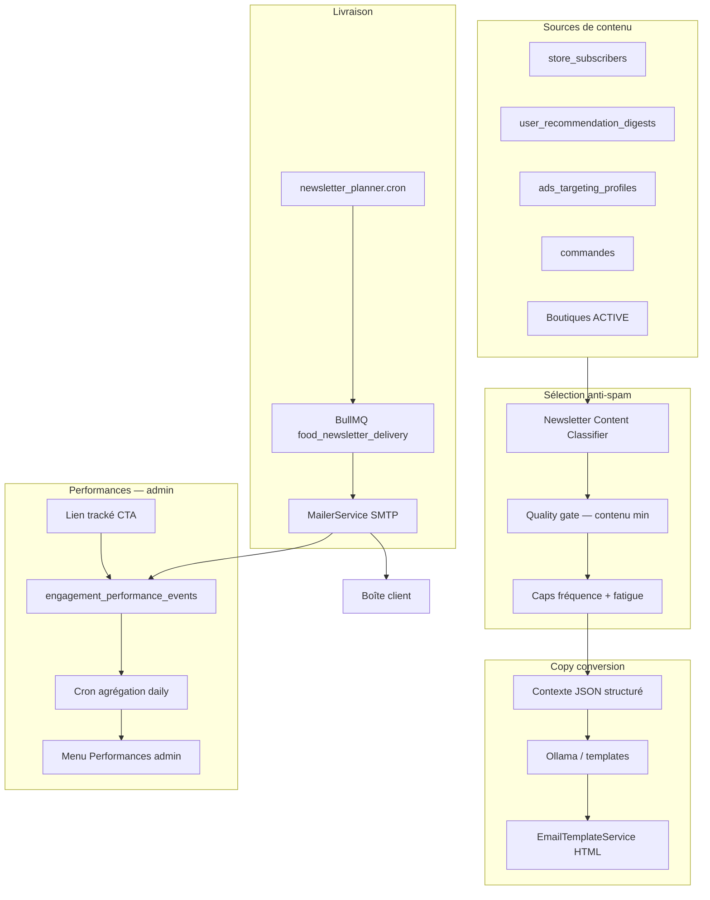

# NEWSLETTER.md — Emails de recommandation Wise Eat (Food & boutiques abonnées)

Document de conception pour **Wise Eat** : envoyer des **emails personnalisés** recommandant plats, articles et nouveautés des **boutiques auxquelles le client est abonné**, avec messages orientés **conversion**, **sans spammer**.

Canal distinct des push FCM (voir `RECOMMENDATION.md`) : l’email permet plus de contexte, un CTA clair et un désabonnement explicite — idéal pour un digest hebdomadaire ou un rappel « commander à nouveau ».

Wise Eat couvre **toutes les cultures** du catalogue (africain, asiatique, méditerranéen, latino, européen, végétarien, etc.). Les emails doivent refléter les goûts réels de l’utilisateur, pas une seule cuisine.

---

## 1. Objectif

| Principe | Description |
|----------|-------------|
| **Pertinence** | Contenu basé sur abonnements boutique, historique, signaux reco — jamais un catalogue générique. |
| **Conversion** | Objet, preheader et corps rédigés pour inciter à ouvrir l’app / commander (copy personnalisée). |
| **Respect des abonnements** | Distinction newsletter vitrine vs reco food vs digest boutiques. |
| **Anti-spam** | Fréquence plafonnée, contenu minimum, backoff, opt-in explicite. |
| **Mesure** | Ouvertures, clics CTA, commandes 48 h, désabonnements — **menu admin Performances** (voir § 9). |

---

## 2. État actuel (à réutiliser)

| Composant | Existant | Rôle |
|-----------|----------|------|
| **SMTP / templates** | `MailerService`, `EmailTemplateService`, `MAIL_SETUP.md` | Envoi + charte Wise Eat |
| **Newsletter blog** | `blog-newsletter-dispatch` + `newsletter_subscribers` | Pattern batch BullMQ (vitrine) |
| **Abonnements boutique** | `store_subscribers` + API `POST /stores/:id/subscribe` | Cœur cible « boutiques suivies » |
| **Reco & intérêts** | `recommendations`, `user_recommendation_digests`, `ads_targeting_profiles` | Scoring contenu |
| **Profil admin** | `GET /admin/users/:userId/interests` | Debug / validation contenu |
| **Opt-in email mobile** | `pref_notif_email` (défaut `false`, local) | **À synchroniser API** |
| **Push reco (doc)** | `RECOMMENDATION.md` | Logique parallèle — ne pas doubler le même jour |
| **Admin Performances** | À créer — menu **Performances** (voir § 9) | KPI email + comparaison push |
| **User Interest admin** | `GET /admin/users/:userId/interests` | Drill-down + preview contenu email |

**Conclusion** : ajouter un module **`food-recommendation-newsletter`** avec planner dédié email, réutilisant le classifier reco et le pattern `BlogNewsletterDispatchQueueService`, et **instrumentation** commune vers le menu **Performances** (hub partagé avec push — `RECOMMENDATION.md` § 9).

---

## 3. Types d’emails (canaux)

| Type | Code | Audience | Contenu |
|------|------|----------|---------|
| **Recommendation Food** | `food_reco_digest` | Clients opt-in reco email | 2–4 plats personnalisés (toutes cultures) + 1 promo éligible max |
| **Subscribed stores** | `store_subscriber_digest` | Users avec `store_subscribers` ≥ 1 | Nouveautés / menu du jour / promos **uniquement** des boutiques suivies |
| **Combined digest** | `wise_eat_weekly` | Opt-in global (recommandé MVP) | Fusion intelligente : section « Vos boutiques » + section « Pour vous » |

**Règle produit** : un seul email par fenêtre — pas trois envois séparés le même jour.

---

## 4. Architecture cible



---

## 5. Sélection du contenu (sans spammer)

### 5.1 Éligibilité utilisateur

```
1. Compte USER actif + email vérifié
2. Opt-in serveur : email_recommendations = true
3. Pas de désabonnement global / catégorie
4. Pas d’email reco identique envoyé < NEWSLETTER_MIN_GAP_DAYS (défaut 7 j)
5. Pas de push reco majeur envoyé < 24 h (éviter push + email même sujet)
```

### 5.2 Quality gate (ne pas envoyer si vide)

| Condition | Seuil |
|-----------|--------|
| Boutiques abonnées avec contenu nouveau | ≥ 1 boutique avec plat/menu/promo < 7 j |
| **OU** candidats reco score | ≥ 2 plats score ≥ `NEWSLETTER_MIN_SCORE` |
| **OU** réachat favori | 1 plat commandé 2×+, pas commandé depuis X jours |
| Exclusion | Tous plats épuisés / boutique INACTIVE / hors région |

Si le quality gate échoue → **skip** (log `skipReason: insufficient_content`), pas d’email vide.

### 5.3 Priorisation du contenu (ordre dans l’email)

1. **Boutiques abonnées** — nouveautés menu du jour, plats récents, offres boutique
2. **Réachat** — « Votre {plat} chez {boutique} »
3. **Découverte** — 1 plat cross-culture (max 30 % du digest)
4. **Promo** — gift code / coupon éligible (max 1 bloc)

### 5.4 Caps anti-spam

| Règle | Défaut |
|-------|--------|
| Max emails reco / 7 j | 1 |
| Max emails reco / 30 j | 3 |
| Max emails même boutique / 14 j | 1 |
| Pause après 2 non-ouvertures consécutives | 21 j |
| Pause après désabonnement partiel | respect immédiat |
| Kill switch | `DISABLE_FOOD_NEWSLETTER=true` |

### 5.5 Créneau d’envoi

- **Jour** : mardi ou jeudi (A/B configurable)
- **Heure** : 10:00–11:30 **fuseau utilisateur** (`resolveEffectiveTimezone` + région)
- **Jitter** : +0 à +45 min (lissage SMTP)

---

## 6. Message de conversion personnalisé

Le LLM **ne choisit pas** les plats (décision déterministe en amont). Il rédige **subject**, **preheader**, **intro** et **CTA** à partir d’un JSON strict.

### 6.1 Prompt système (extrait)

```
Tu es copywriter email pour Wise Eat (marketplace repas multiculturelle).
Langue: {fr|en} selon locale utilisateur.
Contraintes:
- subject ≤ 55 caractères, accrocheur sans clickbait
- preheader ≤ 90 caractères, complète le subject
- intro ≤ 280 caractères, ton chaleureux, bénéfice concret
- cta ≤ 40 caractères (ex. "Commander maintenant", "Voir le menu")
- personnaliser avec prénom si fourni
- ne jamais inventer prix, promos ou plats non listés
- inclusif, pas de stéréotypes culturels
JSON: {"subject","preheader","intro","cta","heroLine"}
```

### 6.2 Contexte injecté

```json
{
  "appName": "Wise Eat",
  "userFirstName": "Alex",
  "locale": "fr-CA",
  "emailType": "wise_eat_weekly",
  "subscribedStores": [
    {
      "name": "Bangkok Express",
      "highlight": "Pad thaï du jour",
      "priceCad": 16.99
    }
  ],
  "recommendedItems": [
    {
      "title": "Poulet rôti aux herbes",
      "storeName": "Chez Marie",
      "reason": "reorder"
    }
  ],
  "promo": { "label": "-10 %", "code": "WISE10", "expiresInDays": 3 },
  "mealContext": "weekend_lunch"
}
```

### 6.3 Templates HTML (fallback sans Llama)

- Bloc hero : logo Wise Eat + `heroLine`
- Grille 2×2 cartes plat (image, titre, boutique, prix, lien deep link web)
- Section « Vos boutiques » avec badge « Abonné »
- CTA principal → `https://wise-eat.com/...` ou `wise-eat://open/...`
- Footer : désabonnement one-click (`/newsletter/unsubscribe?token=...`)

### 6.4 Garde-fous

- Validation JSON + longueurs max
- Liste noire (claims santé, fausses urgences)
- Cache copy 7 j par `(userId, campaignId)`
- A/B : Llama vs template statique

---

## 7. Modèle de données (suggestion)

**Collection** `food_newsletter_candidates` — même logique que push reco, canal `email`.

**Collection** `food_newsletter_schedule`

```typescript
{
  userId,
  email,
  campaignType: 'wise_eat_weekly' | 'store_subscriber_digest' | 'food_reco_digest',
  scheduledAt,
  status: 'pending' | 'sent' | 'skipped' | 'failed',
  skipReason?,
  contentSnapshot: { stores[], items[], promo? },
  copy: {
    subject,
    preheader,
    intro,
    cta,
    source: 'llama' | 'template',
  },
  sentAt?,
  openedAt?,
  clickedAt?,
  /** Attribution commande (Performances § 9) */
  orderId48h?,
  revenue48h?,
}
```

**Extension** `user_notification_preferences` (serveur)

```typescript
{
  userId,
  emailRecommendations: boolean,
  emailStoreDigest: boolean,
  emailMarketing: boolean,
  unsubscribedAt?,
}
```

---

## 8. Variables d’environnement

```env
FOOD_NEWSLETTER_ENABLED=true
FOOD_NEWSLETTER_LLM_ENABLED=true
FOOD_NEWSLETTER_LLM_MODEL=llama3.2:3b
FOOD_NEWSLETTER_CLASSIFIER_CRON=0 5 * * *
FOOD_NEWSLETTER_PLANNER_CRON=0 9 * * 2,4
NEWSLETTER_MIN_GAP_DAYS=7
NEWSLETTER_MIN_SCORE=58
NEWSLETTER_BATCH_SIZE=25
DISABLE_FOOD_NEWSLETTER=false
FOOD_NEWSLETTER_ROLLOUT_PCT=10

# Performances (partagé — voir § 9 et RECOMMENDATION.md § 9)
ENGAGEMENT_PERFORMANCE_AGGREGATION_CRON=0 2 * * *
```

---

## 9. Performances — menu admin & suivi KPI

Le menu **Performances** est le **tableau de bord unifié** Wise Eat pour mesurer l’efficacité des campagnes d’engagement. L’**onglet Newsletter food** couvre ce document ; l’**onglet Push reco** couvre `RECOMMENDATION.md` § 9 ; la **vue d’ensemble** compare les deux canaux.

### 9.1 Emplacement admin (partagé push + email)

| Élément | Valeur |
|---------|--------|
| **Menu sidebar** | Marketing → **Performances** |
| **Route** | `/marketing/performances` |
| **Permission** | `admin.marketing` |
| **Onglet email** | **Newsletter food** |

Voir structure complète et modèle `engagement_performance_events` dans **`RECOMMENDATION.md` § 9.3–9.4** (canal-agnostique, `channel: 'email_newsletter'`).

### 9.2 KPI newsletter food (onglet « Newsletter food »)

| KPI | Formule | Alerte si |
|-----|---------|-----------|
| **Envoyés** | `status=sent` | — |
| **Taux délivrance SMTP** | `accepted / sent` | bounces > 3 % |
| **Taux d’ouverture** | `open / sent` (pixel ou proxy) | < 18 % (digest B2C) |
| **Taux de clic CTA** | `click_cta / open` | < 12 % |
| **Conversion 48 h** | `order_48h / sent` | objectif ≥ 1,5 % |
| **Désabonnement** | `unsubscribe / sent` | > 0,5 % / envoi |
| **Skipped (quality gate)** | `skipReason=insufficient_content` | > 40 % des éligibles |
| **Revenu attribué** | Σ commandes `orderId48h` | — |

**Dimensions de découpe** :

- `campaignType` (`wise_eat_weekly`, `store_subscriber_digest`, `food_reco_digest`)
- Boutique abonnée (`storeId` dans snapshot)
- `copy.source` (llama vs template) — subject / heroLine
- Région, locale, segment (`deal_seeker`, …)
- Section email : « Vos boutiques » vs « Pour vous » vs promo

**Graphiques suggérés** :

- Série : sent / open / click / order_48h par semaine
- Comparaison **email vs push** (vue d’ensemble) : conversion normalisée par contact
- Top subjects par open rate (min 100 envois)
- Répartition skip reasons (anti-spam sain vs contenu catalogue vide)

### 9.3 Instrumentation email

| Point | Event |
|-------|-------|
| SMTP accept / bounce webhook | `newsletter_delivered` ou bounce log |
| Pixel 1×1 ou proxy open | `newsletter_open` |
| Lien CTA avec `utm_campaign` + `scheduleId` | `newsletter_click_cta` |
| Page unsubscribe | `newsletter_unsubscribe` |
| Commande ≤ 48 h avec `campaignId` | `newsletter_order_48h` |
| Planner skip | `newsletter_skipped` + `skipReason` |

**Liens trackés** :

```
https://wise-eat.com/r/{scheduleId}?c=cta&utm_source=wise_eat_newsletter
```

Redirect 302 → deep link / fiche plat + enregistrement `click`.

### 9.4 Vue d’ensemble Performances (push vs email)

| Indicateur | Push | Email | Lecture |
|------------|------|-------|-----------|
| Contacts touchés / 7 j | sent push | sent email | Volume |
| Taux engagement | open/delivered | open/sent | Qualité accroche |
| Conversion | order_24h | order_48h | ROI (fenêtres différentes) |
| Fatigue | dismiss + unsub push | unsub email | Ajuster caps |
| Cannibalisation | même `refId` push+email < 48 h | collision log | § 12 |

**Règle produit** : si un utilisateur a reçu un push reco sur un plat, **ne pas** mettre ce plat en hero email la même semaine (`last_reco_touch_at`).

### 9.5 Actions admin depuis Performances

- **Pause campagne** : `DISABLE_FOOD_NEWSLETTER` ou toggle UI (persist settings)
- **Ajuster caps** : `NEWSLETTER_MIN_GAP_DAYS`, rollout %
- **Preview email** : lien vers User Interest + générateur preview (Phase 4)
- **Export CSV** : campagnes, copy, KPI par cuisine
- **Alertes** : badge rouge si unsub > seuil ou open rate chute > 30 % vs moyenne 30 j

### 9.6 Events (alignés Performances)

| Event | Usage |
|-------|-------|
| `newsletter_queued` | Planification |
| `newsletter_sent` | Volume SMTP |
| `newsletter_open` | Taux ouverture |
| `newsletter_click_cta` | Funnel conversion |
| `newsletter_order_48h` | ROI |
| `newsletter_unsubscribe` | Fatigue / qualité contenu |
| `newsletter_skipped` | Quality gate / anti-spam |

Tous mappés vers `engagement_performance_events` avec `channel: 'email_newsletter'`.

---

## 10. Phases de rollout

### Phase 0 — Fondations (1–2 semaines)

- Sync opt-in email API ↔ app (`pref_notif_email` + catégories)
- Schémas `food_newsletter_*` + tokens désabonnement signés
- Schémas `engagement_performance_events` (partagés push — voir RECOMMENDATION.md)
- **Menu Performances** : squelette + onglet Newsletter (vide)
- Endpoint `GET /users/me/notification-preferences` + `PATCH`
- Kill switch + liens trackés CTA (stub)
- Réutiliser `EmailTemplateService` (bloc carte plat)

**Livrable** : infra prête, aucun envoi auto ; Performances prêt à recevoir events.

---

### Phase 1 — MVP « Subscribed stores » (2 semaines)

- Classifier **uniquement** contenu des boutiques dans `store_subscribers`
- Quality gate : ≥ 1 boutique avec nouveauté
- Template HTML statique FR/EN (sans Llama)
- Planner : **1 email / 7 j max**, mardi 10 h fuseau user
- Rollout 5–10 % (`FOOD_NEWSLETTER_ROLLOUT_PCT`)
- **Performances** : sent, open, skip reasons (onglet Newsletter)

**Livrable** : digest « Vos boutiques Wise Eat » pour abonnés boutique + KPI visibles.

---

### Phase 2 — Recommendation Food + copy Llama (2 semaines)

- Étendre classifier : plats reco (`user_recommendation_digests`, commandes, intérêts)
- Fusion email `wise_eat_weekly` : section boutiques + section « Pour vous »
- `NewsletterCopyService` (Ollama) + fallback templates
- Règle diversité cuisine (max 70 % même famille / email)
- A/B subject Llama vs template
- **Performances** : breakdown copy, top subjects, conversion par section email

**Livrable** : email personnalisé multiculturel avec message de conversion + métriques copy.

---

### Phase 3 — Optimisation conversion (2–3 semaines)

- Segments : `high_intent_buyer`, `deal_seeker`, `churned_risk` (profil ads targeting)
- Copy adaptée au segment (urgence douce vs découverte vs promo)
- Créneaux par région (CA, EU, Afrique)
- Lien tracking + attribution commande
- **Performances** : vue d’ensemble push vs email, alertes unsub, export CSV
- Segments copy (`high_intent_buyer`, …)

**Livrable** : boucle d’apprentissage + pilotage marketing via menu **Performances**.

---

### Phase 4 — Scale & gouvernance (continu)

- Embeddings sémantiques pour affinité plat ↔ recherche
- Prévisualisation admin (User Interest → preview email) dans **Performances**
- Option vendeur : « inclure ma boutique dans digest abonnés » (opt-in boutique)
- Alignement avec push reco : calendrier partagé anti-collision
- Migration SMTP prod (SendGrid / SES) si volume > Gmail limits

**Livrable** : système mature, gouverné, mesurable.

---

## 11. Exemple end-to-end (Phase 2)

1. **Lundi 05:00 UTC** — Classifier : user A abonné à Bangkok Express + Saveurs du Monde ; 3 plats score ≥ 60.
2. **Quality gate** : OK (2 boutiques + 2 plats).
3. **Llama** : subject *« Alex, votre pad thaï et les nouveautés de vos restos »* ; CTA *« Voir le menu »*.
4. **Mardi 10:12 heure Montréal** — envoi SMTP, sections boutiques + reco.
5. User clique → commande sous 48 h → `newsletter_order_48h`.
6. User ignore 2 emails → pause 21 j.
7. **Admin** — Marketing → **Performances** → onglet Newsletter : open 24 %, CTR 14 %, 12 commandes attribuées ; vue d’ensemble : email complète le push sans cannibalisation.

---

## 12. Différences push vs email

| | Push (`RECOMMENDATION.md`) | Email (`NEWSLETTER.md`) |
|--|---------------------------|-------------------------|
| Fréquence | 1 / 24 h max | 1 / 7 j max |
| Contenu | 1 reco + deep link | Digest multi-plats + boutiques |
| Boutiques abonnées | Option nearby | **Priorité explicite** |
| Copy | title + body courts | subject + preheader + HTML |
| Opt-in | push + recommendations | email + reco (défaut off) |
| Collision | éviter même refId 14 j | coordonner via `last_reco_touch_at` |
| **Performances** | Onglet Push reco | Onglet Newsletter food + vue d’ensemble |

---

## 13. Décisions ouvertes

1. Fusionner newsletter vitrine blog et reco food, ou listes séparées ?
2. Email combiné compte Wise Eat + `newsletter_subscribers` vitrine sans compte ?
3. Vendeurs peuvent-ils déclencher un digest à leurs abonnés (avec caps plateforme) ?
4. Fournisseur SMTP production au-delà de Gmail ?
5. Pixel open vs respect vie privée (proxy open sans IP) ?

---

## 14. Résumé exécutif

Construire un **digest email Wise Eat** qui :

1. **Priorise les boutiques suivies** (`store_subscribers`)
2. **Enrichit avec des plats recommandés** (toutes cultures, anti-bulle)
3. **Ne part que si le contenu le vaut** (quality gate + caps)
4. **Convertit via copy personnalisée** (Llama + templates HTML)
5. **Évolue par phases** sans spammer ni cannibaliser les push
6. **Se mesure dans Performances** — menu admin unifié push + email, KPI, alertes, export

L’objectif : **moins d’emails, plus de commandes**, pilotés par data — pas une newsletter générique.

---

## Références code existant

| Fichier | Rôle |
|---------|------|
| `src/modules/blog/blog-newsletter-dispatch.service.ts` | Pattern batch newsletter |
| `src/modules/store-subscribers/store-subscribers.service.ts` | Abonnements boutique |
| `src/modules/mailer/mailer.service.ts` | Envoi SMTP |
| `src/modules/recommendations/recommendations.service.ts` | Scoring plats |
| `src/modules/admin-users/admin-users.service.ts` | Profil intérêts admin |
| `docs/RECOMMENDATION.md` | Push reco + hub Performances partagé |
| `docs/MAIL_SETUP.md` | Config SMTP Wise Eat |
| `africa-meals-admin/app/(alternative)/marketing/performances/` | UI menu **Performances** (à créer) |
| `GET /admin/engagement/performances/*` | API KPI (à créer) |
