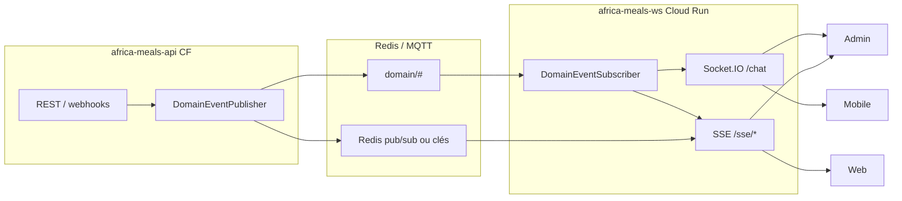

# Roadmap — remplacer le polling par WS / SSE / EDA

> **Date :** 17 juin 2026  
> **Dernière mise à jour :** 17 juin 2026 — **toutes les phases POLL implémentées**  
> **Référence inventaire :** [POLLING_API_CALLS_REPORT.md](./POLLING_API_CALLS_REPORT.md)  
> **Référence EDA existante :** [SSE_AND_EVENT_DRIVEN_IMPLEMENTATION.md](./SSE_AND_EVENT_DRIVEN_IMPLEMENTATION.md)

---

## Statut global

| Phase | Statut | Tickets |
|-------|--------|---------|
| **0** — SSE sur WS | ✅ Terminé | POLL-000, 000b, 000c |
| **1** — Quick wins client | ✅ Terminé | POLL-101…105 |
| **2** — Suivi admin | ✅ Terminé | POLL-201…203 |
| **3** — Fleet & commandes | ✅ Terminé | POLL-301…303 |
| **4** — Dashboards admin | ✅ Terminé | POLL-401…404 |
| **5** — Mobile | ✅ Terminé | POLL-501…504 · POLL-505 hors scope |
| **6** — Web public | ✅ Terminé | POLL-601, 602 |

---

## Contrainte d’architecture (à respecter)

| Service | Hébergement | Rôle |
|---------|-------------|------|
| **africa-meals-api** | Firebase **Cloud Functions Gen 2** (HTTP stateless) | REST, webhooks Stripe, mutations, **publication** d’événements domaine |
| **africa-meals-ws** | **Cloud Run** (processus long-lived) | **Socket.IO**, consommation MQTT, **tous les flux persistants** non adaptés aux Cloud Functions |

### Ce que Cloud Functions ne doit pas porter en prod

- Connexions **WebSocket** (Socket.IO)
- Flux **SSE longue durée** (connexion HTTP ouverte, heartbeats, fan-out)
- État en mémoire partagé entre clients (rooms, présence, tampons stats temps réel)
- Subscribers MQTT / Redis **persistants** côté client

### Pattern cible (en production)



---

## Phases & tickets (statuts)

### Phase 0 — Fondation WS pour SSE ✅

| ID | Titre | Repo | Statut |
|----|-------|------|--------|
| **POLL-000** | Module SSE sur `africa-meals-ws` | `ws` | ✅ `sse-stream/` + Redis subscribe |
| **POLL-000b** | Proxy / routage infra | `admin`, `web` | ✅ `getSseBaseUrl()` / `wise-eat-ws-base` |
| **POLL-000c** | API ne fait que publier | `api` | ✅ `SSE_HOST_ON_WS` + bridge Redis |

---

### Phase 1 — Quick wins client ✅

| ID | Poll remplacé | Solution | Repo | Statut |
|----|---------------|----------|------|--------|
| **POLL-101** | Livreurs 60 s | WS + SSE fleet ; poll retiré (→ POLL-303) | `admin` | ✅ |
| **POLL-102** | Versements 25 s | Skip poll si WS event < 60 s | `admin` | ✅ |
| **POLL-103** | Mobile live-tracking 10 s | Poll si hub stale > 30 s | `mobile` | ✅ |
| **POLL-104** | Santé système ping | Ping off par défaut ; masqué si SSE OK | `admin` | ✅ |
| **POLL-105** | Stats requêtes | Auto-refresh off ; mode diagnostic | `admin` | ✅ |

---

### Phase 2 — Suivi livraisons admin ✅

| ID | Titre | Statut |
|----|-------|--------|
| **POLL-201** | `useWsOrderTracking` sur `suivi/page.tsx` | ✅ |
| **POLL-202** | Snapshot REST 1× au mount | ✅ (endpoints existants) |
| **POLL-203** | Suppression `setInterval(30s)` + bouton Actualiser | ✅ |

---

### Phase 3 — Fleet & commandes admin ✅

| ID | Titre | Statut |
|----|-------|--------|
| **POLL-301** | SSE fleet sur WS | ✅ (POLL-000) |
| **POLL-302** | WS `order:list:changed` → reload commandes seul | ✅ `scheduleSilentOrdersReload` |
| **POLL-303** | Retirer fallback poll livreurs | ✅ poll 60 s supprimé |

---

### Phase 4 — Dashboards admin ✅

| ID | Titre | Statut |
|----|-------|--------|
| **POLL-401** | Réindex : plus de fallback poll 10 s | ✅ probe REST 1× si SSE KO |
| **POLL-402** | Santé SSE sur WS | ✅ (POLL-000 + POLL-104) |
| **POLL-403** | Stats SSE `admin/request-stats` | ✅ API publish Redis + WS SSE |
| **POLL-404** | Checkout subscription SSE sur WS | ✅ (POLL-000) |

---

### Phase 5 — Mobile ✅

| ID | Poll | Statut |
|----|------|--------|
| **POLL-501** | live-tracking stale | ✅ (= POLL-103) |
| **POLL-502** | Panier post-paiement | ✅ WS `order:update` + 2× GET fallback |
| **POLL-503** | Routes Mapbox 8 s | ✅ recalcul sur GPS WS (debounce 800 ms) |
| **POLL-504** | Ads flush 10 s | ✅ + flush on app pause |
| **POLL-505** | Restaurants proches 5 min | ⏸️ **Hors scope** — poll conservé |

---

### Phase 6 — Web public ✅

| ID | Poll | Statut |
|----|------|--------|
| **POLL-601** | Status fallback 60 s | ✅ SSE only + probe manuelle |
| **POLL-602** | Checkout success → WS | ✅ (POLL-000) |

---

## Variables d’environnement production

### `africa-meals-api`

```env
# Domain events (prérequis WS temps réel)
DOMAIN_EVENTS_ENABLED=true
DOMAIN_EVENTS_WS_VIA_BUS=true

# SSE : publication Redis uniquement (pas de HTTP SSE sur CF)
SSE_HOST_ON_WS=true
SSE_REDIS_BRIDGE_ENABLED=true
SSE_HTTP_ON_API=false
SSE_HEARTBEAT_MS=25000
SSE_MAX_CONNECTIONS_PER_USER=3
REQUEST_STATS_SSE_PUSH_MS=10000

# Probes page statut (alimentent Redis → WS SSE)
STATUS_PROBE_WEB_URL=https://wise-eat.com/
STATUS_PROBE_ADMIN_URL=https://admin.wise-eat.com/
WS_BASE_URL=https://ws.wise-eat.com
STATUS_PROBE_TIMEOUT_MS=8000
```

### `africa-meals-ws`

```env
SSE_HTTP_ON_WS=true
SSE_HEARTBEAT_MS=20000
SSE_MAX_CONNECTIONS_PER_USER=5
REQUEST_STATS_SSE_PUSH_MS=10000

DOMAIN_EVENTS_ENABLED=true
DOMAIN_EVENTS_WS_VIA_BUS=true
```

### `africa-meals-admin`

```env
NEXT_PUBLIC_WS_URL=https://ws.wise-eat.com
# Dérivé auto : https://ws.wise-eat.com/api/sse/…
# NEXT_PUBLIC_SSE_BASE_URL=https://ws.wise-eat.com/api
```

### `africa-meals-web`

Meta HTML (`wise-eat-ws-base`) :

```html
<meta name="wise-eat-ws-base" content="https://ws.wise-eat.com">
```

---

## Matrice finale : poll → remplacement

| # | Poll actuel | Remplacement | Service | Statut |
|---|-------------|--------------|---------|--------|
| 1 | Livreurs 60 s | SSE fleet + WS orders | **ws** | ✅ |
| 2 | Suivi 30 s | WS + refresh manuel | **ws** | ✅ |
| 3 | Stats 10 s | SSE push + diagnostic manuel | **ws** | ✅ |
| 4 | Health ping 5–30 s | SSE ; ping = outil manuel | **ws** | ✅ |
| 5 | Stripe status 25 s | WS + poll si WS stale | **ws** | ✅ |
| 6 | Auth 4 s burst | Garder (court) | **api** | ⏸️ OK |
| 7 | Reindex fallback 10 s | SSE ws | **ws** | ✅ |
| 8 | Mobile tracking 10 s | WS + poll si stale | **ws** | ✅ |
| 9 | Cart burst 500 ms | WS order event | **ws** | ✅ |
| 10 | Ads events 10 s | Batch + flush pause | **api** | ✅ |
| 11 | Nearby 5 min | Garder ou FCM | — | ⏸️ P3 |
| 12 | Web status 60 s | SSE public ws | **ws** | ✅ |

---

## Checklist déploiement

1. ✅ Déployer **ws** (Cloud Run) avec `SSE_HTTP_ON_WS=true`
2. ✅ Déployer **api** avec `SSE_HOST_ON_WS=true` (pas de routes SSE HTTP)
3. ✅ Admin / web pointent SSE vers `NEXT_PUBLIC_WS_URL` / `wise-eat-ws-base`
4. Redémarrer les services après mise à jour `.env`
5. Monitorer : connexions SSE actives, absence de poll fallback côté clients

---

## Liens documents

- [POLLING_API_CALLS_REPORT.md](./POLLING_API_CALLS_REPORT.md) — inventaire détaillé
- [SSE_AND_EVENT_DRIVEN_IMPLEMENTATION.md](./SSE_AND_EVENT_DRIVEN_IMPLEMENTATION.md) — tickets EDA/SSE
- [API_WS_OPTIMIZATION.md](./API_WS_OPTIMIZATION.md) — optimisations WS/chat

---

*Document vivant — statuts POLL-xxx à jour au 17 juin 2026.*
