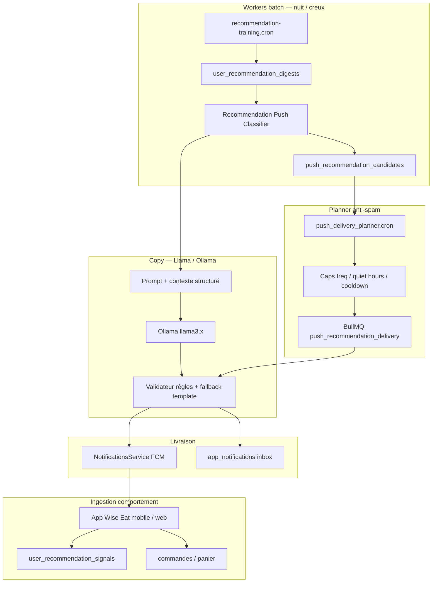

# RECOMMENDATION.md — Notifications push intelligentes (Wise Eat)

Document de conception pour **Wise Eat** : engager les clients avec des **recommandations personnalisées** (plats, boutiques, promos, menu du jour) via push FCM, **sans spammer**.

Wise Eat est une marketplace **multiculturelle** : africaine, asiatique, méditerranéenne, latino-américaine, européenne, végétarienne, etc. Le système doit refléter cette diversité dans le scoring, le timing et la rédaction des messages — sans favoriser une seule culture ni enfermer l’utilisateur dans un seul type de cuisine.

---

## 1. Objectif

- **Pertinence** : une reco utile vaut mieux que dix notifications génériques.
- **Diversité culturelle** : proposer ce que l’utilisateur aime *et* lui faire découvrir d’autres cuisines compatibles avec son profil.
- **Timing** : envoi dans des fenêtres calmes, adaptées au fuseau utilisateur.
- **Fréquence contrôlée** : plafonds journaliers / hebdomadaires, backoff après ignore.
- **Copy convertissante** : texte généré ou enrichi par Llama (Ollama), validé par garde-fous.
- **Mesure** : taux d’ouverture, conversion commande, désabonnements.

---

## 2. État actuel (à réutiliser)

| Composant | Existant | Rôle pour ce projet |
|-----------|----------|---------------------|
| **FCM** | `notifications.service.ts` + Firebase Admin | Canal d’envoi |
| **Jetons** | `user.fcmTokens[]` | Ciblage multi-appareils |
| **Préférences mobile** | `UserNotificationCategory.recommendations` (SharedPreferences) | Opt-in local — **à synchroniser côté API** |
| **Moteur reco** | `recommendations` (signaux, `getFeed`, digests) | Source de candidats |
| **Training batch** | `recommendation-training.cron` (03:15 UTC) | Profils utilisateur pré-calculés |
| **Signaux** | `user_recommendation_signals` (PRODUCT_VIEW, STORE_VIEW, SEARCH_QUERY) | Comportement réel |
| **Digests** | `user_recommendation_digests` | Top produits / boutiques / recherches |
| **Queues** | BullMQ (`domain-event-publisher`, `ws-notify-dispatch-queue`) | Workers async |
| **Ollama** | `search-settings` (embeddings via `OLLAMA_BASE_URL`) | Base infra LLM locale |
| **Promos push** | `gift-code-activation-notifier`, type `gift_code_promo` | Pattern batch + deep link |
| **Marque / deep links** | `APP_NAME=Wise Eat`, schéma `wise-eat://` | Cohérence produit |

**Conclusion** : ne pas repartir de zéro. Ajouter une couche **Push Recommendation Orchestrator** au-dessus du module `recommendations` et de `notifications`.

---

## 3. Architecture cible



---

## 4. Profil utilisateur multiculturel

Le classifier ne doit pas supposer une cuisine dominante. Il construit un **profil gustatif** à partir des signaux :

| Dimension | Sources | Usage |
|-----------|---------|-------|
| **Cuisines préférées** | Catégories produit, tags boutique, historique commandes | Affinité principale |
| **Exploration** | Recherches récentes, vues sans achat | Découverte contrôlée |
| **Région / marché** | `supported-countries`, adresse livraison | Catalogue éligible |
| **Restrictions** | Allergènes, végétarien, halal (si renseigné) | Exclusion stricte |
| **Langue** | Locale app / profil | Copy FR, EN, etc. |

**Règle de diversité** (anti-bulle) :

- Sur 7 jours, max **70 %** des pushes reco du même `cuisineTag` (ex. pas 5 pushes « africain » d’affilée si l’utilisateur commande aussi italien et japonais).
- Injecter occasionnellement un candidat **CROSS_CUISINE_DISCOVERY** (score modéré, copy « découverte ») si l’utilisateur est ouvert aux nouveautés (signaux de recherche variés).

---

## 5. Pipeline en 4 étapes

### Étape A — Classifier & scorer (worker background)

**Job** : `RecommendationPushClassifierWorker` (BullMQ ou extension du cron training).

**Entrées par utilisateur** :

- `user_recommendation_digests` (vues récentes)
- Historique commandes (`orders` — statuts PAID/APPROVED/…)
- `RecommendationsService.getFeed()` (top N candidats, toutes cultures)
- Contexte : région, fuseau, heure locale, jour de la semaine
- Métadonnées catalogue : `cuisineTags`, `businessType`, catégorie produit
- Exclusions : déjà commandé récemment, stock épuisé, boutique inactive, hors région

**Types de reco (classification)** :

| Type | Signal principal | Exemple push |
|------|------------------|--------------|
| `REORDER_FAVORITE` | Produit commandé ≥2×, pas commandé depuis X jours | « Votre pad thaï préféré vous attend chez … » |
| `DAILY_MENU_MATCH` | Menu du jour + historique goûts | « Au menu aujourd’hui : … — un classique que vous aimez » |
| `STORE_RETURN` | STORE_VIEW sans commande | « … a de nouveaux plats depuis votre visite » |
| `TRENDING_LOCAL` | Snapshot global + région | « Tendance à Montréal : … » |
| `CROSS_CUISINE_DISCOVERY` | Affinité sémantique, cuisine non encore commandée | « Envie de changer ? Essayez … près de chez vous » |
| `PROMO_ELIGIBLE` | Gift code / offre applicable | « −15 % sur … — valable 48 h » |
| `NEARBY_OPEN` | Géo + horaires boutique (opt-in nearby) | « … ouvert maintenant à 800 m » |

**Score composite** (0–100) :

```
score = w1×affinité_cuisine
      + w2×affinité_produit
      + w3×urgence
      + w4×nouveauté
      + w5×marge_promo
      − w6×fatigue_push
      − w7×récence_notification
      − w8×sur-représentation_cuisine_7j
```

Seuil minimal configurable (ex. `PUSH_RECO_MIN_SCORE=62`).

**Sortie** : collection `push_recommendation_candidates` :

```typescript
{
  userId,
  candidateType,
  refType: 'product' | 'store' | 'promo',
  refId,
  score,
  cuisineTags: ['thai', 'asian'],
  reasonTags: ['reorder', 'daily_menu'],
  contextSnapshot: {
    productTitle,
    storeName,
    cuisineLabel,      // ex. "Cuisine thaïlandaise"
    price,
    currency,
    imageUrl,
    deepLink,
  },
  computedAt,
  expiresAt, // TTL 24–48 h
}
```

**Index suggérés** :

- `{ userId: 1, score: -1, expiresAt: 1 }`
- Unique partiel `{ userId, refType, refId, candidateType }`
- `{ userId: 1, 'contextSnapshot.cuisineLabel': 1, sentAt: -1 }` (suivi diversité)

---

### Étape B — Génération de copy (Llama / Ollama)

**Principe** : le LLM ne choisit **pas** la reco (décision déterministe en amont). Il **rédige** title + body à partir d’un JSON strict.

**Service** : `RecommendationCopyService` (API Nest).

**Modèle** : `llama3.2:3b` ou `llama3.1:8b` via Ollama (`OLLAMA_BASE_URL`, déjà utilisé pour embeddings).

**Prompt système (extrait)** :

```
Tu es copywriter pour Wise Eat, une app de commande de repas multiculturelle
(africain, asiatique, méditerranéen, latino, européen, végétarien, etc.).
Langue: {fr|en} selon préférence utilisateur.
Contraintes:
- title ≤ 45 caractères
- body ≤ 120 caractères
- ton chaleureux, inclusif, jamais stéréotypé sur une culture
- mettre en avant le plat, la boutique ou l’offre — pas l’origine ethnique de l’utilisateur
- inclure un bénéfice concret (plat, prix, proximité, nouveauté)
- ne jamais inventer prix, promo ou allergènes non fournis
Réponds UNIQUEMENT en JSON: {"title":"...","body":"..."}
```

**Contexte injecté** (depuis `contextSnapshot`) :

```json
{
  "appName": "Wise Eat",
  "candidateType": "REORDER_FAVORITE",
  "productName": "Pad thaï aux crevettes",
  "storeName": "Bangkok Express",
  "cuisineLabel": "Thaïlandaise",
  "priceCad": 16.99,
  "currency": "CAD",
  "discountLabel": null,
  "userFirstName": "Alex",
  "locale": "fr-CA",
  "localTime": "12:15",
  "mealWindow": "lunch"
}
```

**Garde-fous obligatoires** :

1. Parse JSON strict ; sinon **fallback template** i18n.
2. Longueur max title/body.
3. Liste noire : stéréotypes, claims médicaux, comparaisons dégradantes entre cultures.
4. Cache Redis : `(userId, refId, candidateType) → copy` TTL 24 h.
5. **Ne pas appeler Llama en hot path** : générer copy lors du batch classifier ou au moment du plan, pas à l’envoi FCM.

**Templates fallback (sans LLM)** :

| Type | FR | EN |
|------|----|----|
| `REORDER_FAVORITE` | `{productName} vous attend chez {storeName} 🍽️` | `{productName} is waiting at {storeName} 🍽️` |
| `DAILY_MENU_MATCH` | `Au menu aujourd'hui : {productName}` | `On today's menu: {productName}` |
| `CROSS_CUISINE_DISCOVERY` | `Nouveau chez Wise Eat : {productName}` | `New on Wise Eat: {productName}` |

---

### Étape C — Planner / scheduler anti-spam

**Job cron** : `push_delivery_planner.cron` — toutes les **15–30 min** (pas à chaque minute).

**Algorithme par utilisateur éligible** :

```
1. Vérifier opt-in serveur (push + recommendations)
2. Vérifier quiet hours (ex. 22:00–08:30 fuseau utilisateur)
3. Vérifier caps:
   - max 1 reco / 24 h (défaut)
   - max 3 reco / 7 jours
   - min 4 h entre deux pushes reco
4. Choisir le candidat score max non expiré
5. Appliquer règle diversité cuisine (7 jours)
6. Vérifier meal window (optionnel):
   - lunch: 11:00–13:30
   - dinner: 17:30–20:30
7. Planifier slot jitter (+0 à +25 min) pour lisser la charge FCM
8. Enqueue job BullMQ `deliver_push_recommendation`
```

**Collection** : `push_delivery_schedule`

```typescript
{
  userId,
  candidateId,
  scheduledAt,      // UTC
  status: 'pending' | 'sent' | 'skipped' | 'failed',
  skipReason?,       // 'cap_daily', 'quiet_hours', 'no_token', 'cuisine_cap'
  sentAt?,
  copy: { title, body, source: 'llama' | 'template', locale: 'fr' | 'en' },
}
```

**Règles anti-spam avancées** :

| Règle | Comportement |
|-------|--------------|
| **Fatigue** | 2 pushes ignorés consécutifs → pause 72 h |
| **Conversion négative** | Désactivation catégorie côté app → respect immédiat |
| **Collision** | Pas de reco si push commande / chat < 30 min |
| **Priorité** | Commandes > sécurité > reco > marketing broadcast |
| **Dedup contenu** | Même `refId` max 1× / 14 jours |
| **Diversité cuisine** | Max 70 % même cuisine sur 7 jours |
| **Global kill switch** | `DISABLE_PUSH_RECO=true` |

**Fenêtres recommandées par région** (IANA, réutiliser `resolveEffectiveTimezone`) :

- **CA / US** : lunch 11:30–13:00, dinner 17:00–19:30
- **Europe (FR, BE, CH)** : lunch 12:00–14:00, dinner 18:30–20:30
- **Afrique (CM, SN, CI, MA…)** : adapter selon pays et habitudes locales
- Configurable par région dans les paramètres admin (phase 3)

---

### Étape D — Livraison FCM + deep link

**Worker** : `PushRecommendationDeliveryWorker` (BullMQ).

**Payload FCM** (aligné mobile existant) :

```json
{
  "type": "reco_push",
  "category": "recommendations",
  "candidateType": "REORDER_FAVORITE",
  "refType": "product",
  "refId": "...",
  "storeId": "...",
  "cuisineTags": ["thai", "asian"],
  "deepLink": "wise-eat://open/product/{id}",
  "campaignId": "wise_eat_push_reco_{scheduleId}",
  "imageUrl": "..."
}
```

**Côté mobile** (Flutter `wise_eat`) :

- Mapper `reco_push` → `UserNotificationCategory.recommendations` dans `categoryForPushType`.
- Deep link vers fiche produit / boutique / promo.
- Tracker ouverture → `POST /recommendations/track` avec kind `PUSH_OPEN` (nouveau signal).

**Côté API** :

- `NotificationsService.createUserNotification` + `sendPush: true`
- Canal Android : aujourd’hui `african_meals_promotions` (legacy) — **cible** : `wise_eat_recommendations` ou réutilisation canal promos avec `type: reco_push`
- Écrire dans inbox pour historique

---

## 6. Nouveaux modules / fichiers suggérés

```
africa-meals-api/src/modules/push-recommendations/
├── push-recommendations.module.ts
├── push-recommendation-classifier.service.ts   # scoring + candidats
├── push-recommendation-copy.service.ts         # Ollama / templates
├── push-recommendation-planner.service.ts      # caps + scheduling + diversité
├── push-recommendation-delivery.service.ts     # FCM
├── push-recommendation-classifier.cron.ts      # ex. 04:00 UTC
├── push-recommendation-planner.cron.ts         # */20 * * * *
├── push-recommendation-delivery.worker.ts      # BullMQ consumer
├── dto/
└── schemas/
    ├── push-recommendation-candidate.schema.ts
    ├── push-delivery-schedule.schema.ts
    └── push-recommendation-metrics.schema.ts
```

**Extension mobile** :

- Sync préférences push → API (`PUT /users/me/notification-preferences`)
- Handler `reco_push` + analytics

**Admin Wise Eat (phase 2)** :

- Dashboard : volume, CTR, conversions, répartition par cuisine, top copy
- Toggle global + caps éditables
- Pause campagne par région ou par type de reco

---

## 7. Intégration Llama (Ollama)

Réutiliser le pattern `search-settings.service._embedViaOllama` :

```http
POST {OLLAMA_BASE_URL}/api/generate
Content-Type: application/json

{
  "model": "llama3.2:3b",
  "prompt": "...",
  "stream": false,
  "format": "json",
  "options": { "temperature": 0.4, "num_predict": 120 }
}
```

**Variables d’environnement** :

```env
APP_NAME=Wise Eat

PUSH_RECO_LLM_ENABLED=true
PUSH_RECO_LLM_PROVIDER=ollama          # ollama | openai_compatible
PUSH_RECO_LLM_MODEL=llama3.2:3b
PUSH_RECO_LLM_BASE_URL=http://127.0.0.1:11434
PUSH_RECO_LLM_TIMEOUT_MS=8000
PUSH_RECO_LLM_MAX_PER_MINUTE=30

PUSH_RECO_CLASSIFIER_CRON=0 4 * * *
PUSH_RECO_PLANNER_CRON=*/20 * * * *
PUSH_RECO_MAX_DAILY=1
PUSH_RECO_MAX_WEEKLY=3
PUSH_RECO_MIN_GAP_HOURS=4
PUSH_RECO_QUIET_START=22:00
PUSH_RECO_QUIET_END=08:30
PUSH_RECO_MIN_SCORE=62
PUSH_RECO_CUISINE_DIVERSITY_MAX_PCT=70   # max même cuisine sur 7 jours
DISABLE_PUSH_RECO=false
PUSH_RECO_ROLLOUT_PCT=10
```

**Infra** : Ollama sur VM dédiée ou sidecar Docker ; workers séparés (PM2 process ou conteneur worker) pour ne pas bloquer l’API Wise Eat.

---

## 8. Données & privacy

- **Minimiser PII dans prompts Llama** : prénom optionnel, jamais email/téléphone.
- **Neutralité culturelle** : ne pas inférer origine ou ethnicité ; s’appuyer sur comportement catalogue et préférences explicites.
- **Rétention** : candidats 48 h, schedules 90 jours, métriques agrégées 1 an.
- **Consentement** : respecter opt-in ; préférences actuellement locales → **priorité P0** : persister côté serveur.
- **RGPD / Loi 25** : désabonnement via réglages app ; log des envois.

---

## 9. Métriques & boucle d’apprentissage

**Events à enregistrer** :

| Event | Usage |
|-------|-------|
| `push_reco_sent` | Volume |
| `push_reco_delivered` | FCM ack |
| `push_reco_open` | CTR |
| `push_reco_dismiss` | Fatigue |
| `push_reco_order_24h` | Conversion |
| `push_reco_by_cuisine` | Diversité & performance par culture |

**Feedback dans le classifier** :

- ↑ poids candidats ouverts + commandés (par cuisine et global)
- ↓ poids types / cuisines ignorés 3× de suite
- A/B test copy Llama vs template (50/50) sur 2 semaines
- Mesurer si `CROSS_CUISINE_DISCOVERY` convertit sans augmenter les désabonnements

---

## 10. Plan de rollout par phases

### Phase 0 — Fondations (1–2 semaines)

- Sync préférences notification API ↔ mobile
- Schémas Mongo + module squelette
- Métriques + kill switch
- Tags cuisine dans `contextSnapshot` (depuis catégories / boutique)

### Phase 1 — MVP sans LLM (2 semaines)

- Classifier `REORDER_FAVORITE` + `DAILY_MENU_MATCH` (toutes cultures)
- Templates FR/EN statiques
- Planner caps + quiet hours + règle diversité basique
- 5–10 % utilisateurs actifs (`PUSH_RECO_ROLLOUT_PCT`)

### Phase 2 — Llama copy (1 semaine)

- `RecommendationCopyService` + cache + fallback multilingue
- A/B Llama vs template
- Prompts validés sur échantillon multiculturel (≥ 5 familles de cuisine)

### Phase 3 — Enrichissement (2–3 semaines)

- Types TRENDING, PROMO, NEARBY, CROSS_CUISINE_DISCOVERY
- Admin dashboard Wise Eat
- Meal windows par région (`supported-countries`)

### Phase 4 — Optimisation

- Embeddings sémantiques (Ollama nomic) : affinité plat ↔ recherche, découverte inter-cultures
- Bandit léger sur créneaux horaires et types de reco

---

## 11. Risques & mitigations

| Risque | Mitigation |
|--------|------------|
| Spam / uninstall | Caps stricts, fatigue, quiet hours |
| Bulle culturelle (toujours la même cuisine) | Règle diversité 70 % + CROSS_CUISINE_DISCOVERY |
| Copy stéréotypée | Prompt inclusif + liste noire + revue échantillons |
| Hallucinations Llama | JSON schema + validation + fallback |
| Latence Ollama | Batch offline, cache, timeout court |
| Préférences non sync | Bloquer envoi si pas de consent serveur |
| Charge FCM | Jitter + BullMQ concurrency limitée |
| Reco hors stock | Re-valider stock/menu du jour au delivery worker |

---

## 12. Exemple end-to-end

1. **03:15 UTC** — `recommendation-training` met à jour digest user A (top : pad thaï, boutique Bangkok Express, recherche « sushi »).
2. **04:00 UTC** — Classifier : user A → `REORDER_FAVORITE` pad thaï, score 78 (cuisine « thaï » OK vs cap 7 jours).
3. **04:05 UTC** — Ollama génère : *« Votre pad thaï vous attend »* / *« Bangkok Express — prêt en 25 min »*.
4. **11:42 heure Montréal** — Planner : meal window lunch, cap OK → schedule 11:47.
5. **11:47** — Worker FCM envoie `type: reco_push`, deep link `wise-eat://open/product/{id}`.
6. User ouvre → track `PUSH_OPEN` → commande → `push_reco_order_24h`.
7. **Semaine suivante** — push `CROSS_CUISINE_DISCOVERY` sushi (recherche récente, pas encore commandé).

---

## 13. Décisions ouvertes

1. **Canal FCM** : renommer `african_meals_promotions` → `wise_eat_recommendations` ou canal unique Wise Eat ?
2. **Tags cuisine** : catégories produit existantes vs taxonomie dédiée multiculturelle ?
3. **Langue copy** : locale app, région, ou profil utilisateur ?
4. **Ollama** : self-hosted vs API compatible OpenAI en prod ?
5. **Workers** : même process PM2 `africa-meals-api` ou worker BullMQ séparé (recommandé) ?

---

## 14. Résumé exécutif

Construire un **orchestrateur push Wise Eat** au-dessus du moteur `recommendations` existant :

1. **Classifier batch** → candidats scorés en Mongo, **toutes cultures**, avec règle de diversité
2. **Llama (Ollama)** → copy convertissante, inclusive et multilingue, avec fallback template
3. **Planner cron + BullMQ** → livraison lissée, caps, quiet hours, meal windows par région
4. **FCM existant** → deep links `wise-eat://` + tracking pour boucle d’apprentissage

L’objectif n’est pas « plus de notifications », mais **moins de notifications, mieux ciblées, représentatives de la richesse du catalogue Wise Eat, et mieux rédigées**.

---

## Références code existant

| Fichier | Rôle |
|---------|------|
| `src/modules/recommendations/recommendations.service.ts` | Fil reco + signaux |
| `src/modules/recommendations/recommendation-training.cron.ts` | Training batch |
| `src/modules/recommendations/recommendation-training.service.ts` | Digests + snapshot |
| `src/modules/notifications/notifications.service.ts` | Envoi FCM |
| `src/modules/search-settings/search-settings.service.ts` | Ollama embeddings |
| `src/modules/gift-codes/gift-code-activation-notifier.service.ts` | Pattern batch promo |
| `src/modules/supported-countries/region-timezone.util.ts` | Fuseaux & régions |
| `africa-meals-mobile/lib/push/user_notification_preferences.dart` | Opt-in client |
