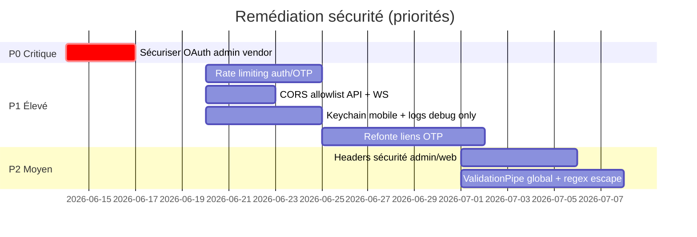

# Audit de sécurité — AfrikaMeals / Wise Eat

**Date :** 14 juin 2026  
**Périmètre :** `africa-meals-api`, `africa-meals-admin`, `africa-meals-mobile`, `africa-meals-web`, `africa-meals-ws`

---

## Score global : **73 / 100**

| Composant | Score | Niveau |
|-----------|-------|--------|
| **API (NestJS)** | 74/100 | Acceptable |
| **Admin (Next.js)** | 62/100 | Moyen |
| **Mobile (Flutter)** | 55/100 | Moyen |
| **Web (Firebase Hosting)** | 72/100 | Acceptable |
| **WebSocket** | 68/100 | Acceptable |

**Verdict :** L’architecture de base est solide (JWT, guards, 2FA e-mail, webhooks Stripe signés, auth WS). **C-01, C-02 et C-03 ✅ DONE**. Il reste **1 faille critique côté API** (OAuth admin vendor) et plusieurs risques **élevés** côté clients. **Action ops :** révoquer la clé Firebase exposée — voir `docs/FIREBASE_KEY_ROTATION.md`.

---

## Répartition des findings

| Sévérité | Nombre | ❌ NOT YET | ⚠️ PENDING | ✅ DONE | Action |
|----------|--------|------------|------------|---------|--------|
| Critique | 4 | 1 | 0 | 3 | Corriger immédiatement |
| Élevée | 12 | 12 | 0 | 0 | Corriger sous 1–2 semaines |
| Moyenne | 18 | 18 | 0 | 0 | Planifier sprint sécurité |
| Faible | 10 | 8 | 0 | 2 | Amélioration continue |
| Positif | 8 | — | — | — | Maintenir |

*Mettre à jour les compteurs lors du passage d’un finding à **⚠️ PENDING** ou **✅ DONE**.*

### Légende — suivi des findings

| Statut | Signification |
|--------|---------------|
| **✅ DONE** | Fix déployé ou validé en revue de code ; ou risque documenté et accepté |
| **❌ NOT YET** | Non traité — finding actif |
| **⚠️ PENDING** | Remédiation démarrée (PR, branche, ticket) |

| Action | Signification |
|--------|---------------|
| **Fix** | Corriger un comportement existant dangereux |
| **Add** | Ajouter une protection manquante |
| **Improve** | Renforcer une mesure partielle |
| **Info** | Informatif / bonne pratique, pas de fix urgent |

---

## Findings — à corriger, ajouter ou améliorer

### Critique (P0 — immédiat)

| ID | App | Action | Statut | Issue | Recommandation |
|----|-----|--------|--------|-------|----------------|
| **C-01** | API | Fix | ✅ DONE | ~~`GET /api/debug/env` expose **toutes** les variables d’env avec Basic Auth hardcodé~~ | Controller non enregistré si `NODE_ENV=production` ; opt-in `ENABLE_ENV_DEBUG=true` + credentials via `ENV_DEBUG_BASIC_*` (plus de secrets dans le code) |
| **C-02** | API | Fix | ✅ DONE | ~~`accounts.json` (clé privée Firebase) présent dans le repo, non ignoré par Git~~ | Fichier retiré du suivi Git + `.gitignore` ; credentials via `AM_FIREBASE_SERVICE_ACCOUNT_*` ; modèle `accounts.json.example` ; rotation documentée dans `FIREBASE_KEY_ROTATION.md` |
| **C-03** | API | Fix | ✅ DONE | ~~`POST /mailer/test-email` **sans authentification** — relay SMTP ouvert~~ | Route non enregistrée en production ; opt-in `ENABLE_MAILER_TEST_EMAIL=true` ; JWT **ADMIN** + limite 5 envois / 15 min |
| **C-04** | API | Fix | ❌ NOT YET | `POST /auth/admin/google` (et Apple/Facebook) **publics** — création de comptes VENDOR pour tout OAuth valide | Whitelist domaines/e-mails, invitation obligatoire, ou guard admin pré-auth |

---

### Élevée (P1 — 1–2 semaines)

| ID | App | Action | Statut | Issue | Recommandation |
|----|-----|--------|--------|-------|----------------|
| **H-01** | API | Fix | ❌ NOT YET | CORS `origin: true` + `credentials: true` — toute origine acceptée | Allowlist stricte (`CORS_ORIGIN`) : admin, web, app |
| **H-02** | API | Add | ❌ NOT YET | Aucun rate limiting sur auth/OTP (`/login`, `/verify-2fa`, `/forgot-password`) | `@nestjs/throttler` ou `express-rate-limit` sur routes sensibles |
| **H-03** | API | Improve | ❌ NOT YET | JWT expiration 1 an, claims minimaux (`sub` seul), pas de rotation refresh | Réduire TTL (15–60 min access), refresh rotation, claims `type`/`jti` |
| **H-04** | API | Fix | ❌ NOT YET | OTP générés via `Math.random()`, stockés en clair en DB | `crypto.randomBytes`, hash bcrypt des codes, expiration courte |
| **H-05** | API | Fix | ❌ NOT YET | Logs de mots de passe et codes OTP dans `auth.controller.ts` | Supprimer/redacter ; audit des logs HTTP |
| **H-06** | API | Fix | ❌ NOT YET | `checkAccount` public — énumération + fuite PII (FCM, Stripe, etc.) | Réponse générique ; champs minimaux |
| **H-07** | Admin | Improve | ❌ NOT YET | JWT + refresh en `localStorage` — vol XSS = session complète | Session httpOnly via BFF Next.js ou cookies Secure |
| **H-08** | Mobile | Fix | ❌ NOT YET | JWT en `SharedPreferences` non chiffré | `flutter_secure_storage` (Keychain / Keystore) |
| **H-09** | Mobile | Fix | ❌ NOT YET | `NetworkLogInterceptor` actif en **release** — mots de passe logués | `if (kDebugMode)` uniquement ; redacter `password`, `code` |
| **H-10** | Web + Mobile | Fix | ❌ NOT YET | Codes OTP dans URLs deep link (`?email=&code=`) | Token opaque à usage unique ; éviter le code dans l’URL |
| **H-11** | Mobile | Fix | ❌ NOT YET | Validation hôte `host.contains('wise-eat.com')` — accepte `evil-wise-eat.com` | Allowlist : `host == 'wise-eat.com' \|\| host.endsWith('.wise-eat.com')` |
| **H-12** | Admin | Fix | ❌ NOT YET | `.env` non ignoré par Git (seul `.env*.local`) | Ajouter `.env` au `.gitignore` |

---

### Moyenne (P2 — sprint sécurité)

| ID | App | Action | Statut | Issue | Recommandation |
|----|-----|--------|--------|-------|----------------|
| **M-01** | API | Improve | ❌ NOT YET | ADMIN sans rôles = toutes permissions | Exiger `platformRoleIds` ou rôle par défaut minimal |
| **M-02** | API | Add | ❌ NOT YET | Swagger / GraphQL playground actifs par défaut | `DISABLE_SWAGGER=true`, `DISABLE_GRAPHQL_PLAYGROUND=true` en prod |
| **M-03** | API | Improve | ❌ NOT YET | Body parser 60 MB — vecteur DoS | Réduire à 1–5 MB sauf routes upload dédiées |
| **M-04** | API | Fix | ❌ NOT YET | Regex Mongo non échappées (ReDoS / injection) | `_escapeRegex()` sur toutes entrées `$regex` |
| **M-05** | API | Add | ❌ NOT YET | Pas de `ValidationPipe` global avec `whitelist` | Pipe global : `whitelist`, `forbidNonWhitelisted` |
| **M-06** | API | Improve | ❌ NOT YET | Uploads : MIME côté client, pas de magic bytes | Valider signature fichier ; limiter extensions |
| **M-07** | API | Improve | ❌ NOT YET | reCAPTCHA en mode monitor (accepte tokens invalides) | `RECAPTCHA_ENTERPRISE_ENFORCE=true` en prod |
| **M-08** | API | Improve | ❌ NOT YET | Refresh JWT fallback sur `JWT_SECRET` si absent | Secrets distincts obligatoires |
| **M-09** | Admin | Add | ❌ NOT YET | Pas de CSP, HSTS, X-Frame-Options | Headers sécurité dans `next.config.js` |
| **M-10** | Admin | Improve | ❌ NOT YET | Cookie `ae_has_session=1` forgeable (hint UI) | Valider JWT côté middleware serveur |
| **M-11** | Admin | Fix | ❌ NOT YET | `dangerouslySetInnerHTML` sur mails inbox | DOMPurify ou rendu texte |
| **M-12** | Mobile | Add | ❌ NOT YET | Pas de refresh token / renouvellement auto | Intercepteur 401 → refresh ou re-auth |
| **M-13** | Mobile | Improve | ❌ NOT YET | `.env` embarqué dans APK/IPA | Secrets serveur interdits ; restrictions bundle/domaine sur clés publiques |
| **M-14** | Mobile | Improve | ❌ NOT YET | Schéma `wise-eat://` hijackable (Android) | App Links HTTPS vérifiés en priorité |
| **M-15** | WS | Fix | ❌ NOT YET | JWT accepté en query string (`?token=`) | Uniquement `handshake.auth.token` |
| **M-16** | WS | Improve | ❌ NOT YET | CORS `origin: true` | Allowlist origines |
| **M-17** | Web | Add | ❌ NOT YET | Headers sécurité partiels (nosniff seul) | CSP, HSTS, frame-ancestors |
| **M-18** | Web | Improve | ❌ NOT YET | Tracking pub sans auth | Token signé, rate limit API |

---

### Faible (P3 — backlog)

| ID | App | Action | Statut | Issue | Recommandation |
|----|-----|--------|--------|-------|----------------|
| **L-01** | API | Improve | ❌ NOT YET | bcryptjs rounds=10 | Passer à `bcrypt` natif, 12 rounds |
| **L-02** | API | Improve | ❌ NOT YET | Comparaison internal secret non timing-safe | `crypto.timingSafeEqual` |
| **L-03** | API | Add | ❌ NOT YET | Pas de filtre d’exception global | Masquer stack traces en prod |
| **L-04** | API | Improve | ❌ NOT YET | Mots de passe démo hardcodés dans seeds | Désactiver seeds en prod |
| **L-05** | API | Improve | ❌ NOT YET | `LOG_HTTP_BODIES` peut logger credentials | Désactivé par défaut en prod |
| **L-06** | Admin | Info | ✅ DONE | Décode JWT client sans vérif signature | OK si usage UI uniquement (risque accepté) |
| **L-07** | Mobile | Add | ❌ NOT YET | Pas de certificate pinning | Pinning optionnel pour API prod |
| **L-08** | Mobile | Info | ✅ DONE | Clés Firebase/Mapbox publiques (attendu) | Restrictions Firebase Console (risque accepté) |
| **L-09** | API | Add | ❌ NOT YET | `npm audit` non en CI | Dependabot + audit pipeline |
| **L-10** | API | Improve | ❌ NOT YET | NestJS v9 / apollo-server v3 anciens | Plan de mise à jour |

---

## Points positifs (à conserver)

| Domaine | Détail |
|---------|--------|
| Stripe webhooks | `constructEvent` sur `rawBody` avec secrets multiples |
| Auth WS | JWT vérifié à la connexion ; `assertParticipant` sur messages |
| 2FA e-mail | Implémenté admin + mobile (`verify-2fa`, `email-2fa/*`) |
| Forgot password | Réponse générique si email inconnu (anti-énumération) |
| Firebase OAuth | `verifyIdToken` + vérif provider |
| Google Merchant | Basic Auth avec `timingSafeEqual` |
| Chat admin streams | Contrôle `userType === 'ADMIN'` |
| Deep links widget | Redirection login si action sensible sans auth |
| Contact web | reCAPTCHA Enterprise |
| Logger mobile | Masque en-tête `Authorization` (body non redacté) |

---

## Roadmap recommandée

---

## Synthèse par thème

| Thème | État | Statut global | Priorité |
|-------|------|---------------|----------|
| Authentification | Bonne base, JWT trop long, OTP faibles | ❌ NOT YET | P1 |
| Autorisation | Guards OK, failles OAuth admin + ADMIN sans rôles | ❌ NOT YET | P0–P2 |
| Secrets | Dump env + accounts.json corrigés (C-01, C-02) ; rotation clé ops | ⚠️ PENDING | P0 |
| Stockage tokens | Faible (localStorage, SharedPreferences) | ❌ NOT YET | P1 |
| Transport | HTTPS OK, pas de pinning | ❌ NOT YET | P3 |
| Input validation | Partielle, regex à durcir | ❌ NOT YET | P2 |
| Rate limiting | Absent | ❌ NOT YET | P1 |
| CORS | Trop permissif | ❌ NOT YET | P1 |
| Logs | Fuites passwords/OTP | ❌ NOT YET | P1 |
| Paiements (Stripe) | Webhooks OK | ✅ DONE | — |
| Deep links | OTP exposés, validation hôte faible | ❌ NOT YET | P1 |
| Headers HTTP | Manquants admin/web | ❌ NOT YET | P2 |
| Dépendances | Frameworks anciens, audit à automatiser | ❌ NOT YET | P3 |

---

## Conclusion

**73/100** — Le produit n’est **pas prêt pour une posture « sécurité production »** sans corriger le **dernier finding critique (C-04)**. Une fois P0 et P1 traités (estimation : 2–3 semaines), le score devrait monter vers **75–80/100**.

Les corrections les plus impactantes :

1. ~~Sécuriser `POST /mailer/test-email`~~ (C-03 ✅ DONE)
2. ~~Retirer `accounts.json` du dépôt~~ (C-02 ✅ DONE) — **révoquer la clé exposée** (`FIREBASE_KEY_ROTATION.md`)
3. Protéger la création VENDOR OAuth (C-04)
4. Rate limiting + CORS restrictif + OTP cryptographiques
5. Keychain mobile + logs debug-only + refonte liens OTP
