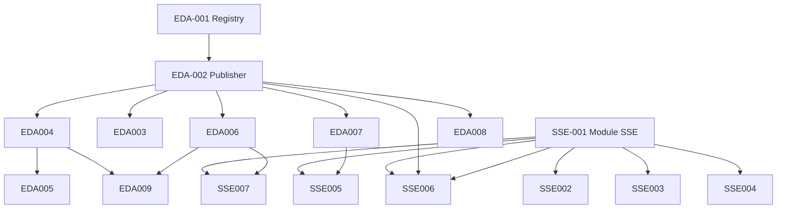

# SSE & architecture événementielle — plan d’implémentation par ticket

**Statut global :** Phase 0–3 **terminée** (EDA-001→009, SSE-001→007) — backlog **clos**  
**Reste à faire :** [déploiement prod](#checklist-déploiement) uniquement  
**Activation prod EDA :** `DOMAIN_EVENTS_ENABLED=true` · `DOMAIN_EVENTS_WS_VIA_BUS=true` **OK**  
**Dernière mise à jour :** 2026-06-17  
**Portée :** monorepo Wise Eat (`api`, `ws`, `admin`, `web`, `mobile`)

Ce document sert de backlog exécutable : un ticket = une PR (ou un lot cohérent). Cocher les cases au fil de l’implémentation.

---

## Comment utiliser ce document

1. Respecter l’ordre des **dépendances** (`Dépend de`).
2. Marquer le ticket : `à faire` → `en cours` → `partiel` → `terminé` dans la colonne Statut du tableau index.
3. Ne pas mélanger SSE (flux read-only client) et EDA (découplage backend) dans la même PR sauf ticket explicite.
4. **WebSocket** reste le choix pour chat, frappe, présence et commandes temps réel — ne pas remplacer par SSE.

### Conventions ticket

| Champ | Description |
|-------|-------------|
| **ID** | `SSE-xxx` (Server-Sent Events) ou `EDA-xxx` (Event-Driven Architecture) |
| **Repos** | Applications touchées |
| **Priorité** | P0 critique · P1 haute · P2 moyenne · P3 basse |
| **Statut `partiel`** | Infra / routes / handlers livrés ; critères d’acceptation ou publishers pas entièrement atteints |

---

## État actuel (2026-06-17)

| Mécanisme | Où | Usage |
|-----------|-----|--------|
| Socket.IO | `africa-meals-ws` | Chat, commandes, ads live, Stripe Connect |
| BullMQ / MQTT | `africa-meals-api`, `africa-meals-ws` | Dispatch WS notify, bus domaine, ads-notify |
| **SSE** | `africa-meals-api` | Reindex, health admin, status web, fleet, jobs, checkout |
| Polling HTTP (fallback) | `admin` | Fleet livreurs 60 s (`LIVREURS_POLL_MS`), reindex/health si SSE coupé |
| Bus domaine | `api` → MQTT → `ws` | Actif si `DOMAIN_EVENTS_ENABLED=true` |
| `order_status_events` | `api` | Journal d’audit + handler EDA-004 |

---

## Index des tickets

| ID | Titre | Priorité | Statut | Dépend de |
|----|-------|----------|--------|-----------|
| EDA-001 | Schéma & registry des événements domaine | P0 | terminé | — |
| EDA-002 | Publisher domaine (API) sur BullMQ/MQTT | P0 | terminé | EDA-001 |
| EDA-003 | Consumer générique côté WS | P1 | terminé | EDA-002 |
| SSE-001 | Module SSE NestJS + auth | P0 | terminé | — |
| SSE-002 | Flux progression réindexation search | P1 | terminé | SSE-001 |
| SSE-003 | Flux santé système admin | P1 | terminé | SSE-001 |
| SSE-004 | Page status web (remplace polling) | P2 | terminé | SSE-001 |
| EDA-004 | Événements commande `order.*` | P0 | terminé | EDA-002 |
| EDA-005 | Découpler `OrdersService` des notifiers | P1 | terminé | EDA-004 |
| EDA-006 | Stripe webhook → événements paiement | P1 | terminé | EDA-002 |
| EDA-007 | Événements livreur `agent.*` | P2 | terminé | EDA-002 |
| SSE-005 | Flux fleet livreurs admin | P2 | terminé | SSE-001, EDA-007 |
| EDA-008 | Événements ads `ad.*` (généralisation) | P2 | terminé | EDA-002 |
| SSE-006 | Progression jobs admin (DB, rapports, emails) | P3 | terminé | SSE-001, EDA-002 |
| EDA-009 | Refunds & subscriptions event-driven | P3 | terminé | EDA-004, EDA-006 |
| SSE-007 | Retour Stripe Checkout web (optionnel) | P3 | terminé | SSE-001, EDA-006 |

---

## Phase 0 — Fondations

### EDA-001 — Schéma & registry des événements domaine

**Repos :** `africa-meals-api` (éventuellement `africa-meals-ws` pour lecture)  
**Priorité :** P0  
**Dépend de :** —

#### Objectif

Définir un vocabulaire d’événements stable, versionné, documenté — distinct du journal `order_status_events`.

#### Travail

- [x] Créer `src/common/domain-events/` (ou `src/modules/domain-events/`) :
  - [x] Types TypeScript : `DomainEventEnvelope<T>` (`id`, `type`, `version`, `occurredAt`, `payload`, `metadata`).
  - [x] Enum / union des `type` initiaux (voir EDA-004, EDA-006, EDA-007).
  - [x] `domain-event.registry.ts` : mapping `type` → validateur Zod/class-validator.
- [x] Documenter le catalogue dans ce fichier (section **Catalogue événements** ci-dessous).
- [x] Règle : chaque événement a un `type` immuable ; évolution = nouveau `version` ou nouveau `type`.

#### Implémentation (2026-06-17)

- Module Nest global : `DomainEventsModule` + `DomainEventRegistryService`.
- Registry : `src/common/domain-events/domain-event.registry.ts` (22 types, version schéma `1`).
- Validation : `buildValidatedDomainEvent()` / `validateDomainEventEnvelope()` (class-validator).
- Tests : `domain-event.registry.spec.ts`.

#### Critères d’acceptation

- Impossible de publier un événement sans `type` enregistré dans le registry.
- Les payloads sont validés avant enqueue.

#### Notes

- Ne pas renommer les topics MQTT existants (`order/update`, etc.) dans ce ticket — mapping dans EDA-002.

---

### EDA-002 — Publisher domaine (API) sur BullMQ/MQTT

**Repos :** `africa-meals-api`  
**Priorité :** P0  
**Dépend de :** EDA-001

#### Objectif

Un seul service `DomainEventPublisher` qui enqueue ou publie MQTT, en réutilisant l’infra `WsNotifyDispatchQueueService` / MQTT existante.

#### Travail

- [x] `DomainEventPublisherService.publish(event: DomainEventEnvelope)`.
- [x] Topic MQTT : `africameals/domain/{type}` (préfixe configurable, distinct de `internal/ws`).
- [x] Queue BullMQ : `domain-events` (nouvelle queue ou extension de la config Redis existante).
- [x] Idempotence : `event.id` (UUID) stocké / ignoré si doublon (TTL Redis ou collection `domain_event_outbox`).
- [x] Feature flag : `DOMAIN_EVENTS_ENABLED` + toggle infra (`mqBrokerEnabled`, `redisManagerEnabled`).
- [x] Fallback synchrone si Redis/MQTT absent (log + pas de crash métier).

#### Implémentation (2026-06-17)

- `DomainEventPublisherService` : `publish(draft)` + `publishEnvelope(envelope)`.
- BullMQ queue `domain-events` (worker → MQTT).
- Idempotence Redis `SET NX EX` (`DomainEventIdempotencyStore`) + fallback mémoire.
- Env : `DOMAIN_EVENTS_*` documentés dans `.env.example`.
- Tests : `domain-event-publisher.service.spec.ts`, `domain-event-idempotency.store.spec.ts`.

#### Notes EDA-002 (2026-06-17)

- Handlers in-process exécutés via queue BullMQ `domain-events-handlers` (**OPT-001** ✅).
- `publish()` fire-and-forget handlers (`DOMAIN_EVENTS_HANDLERS_ASYNC=true` par défaut) ; rollback via `DOMAIN_EVENTS_HANDLERS_ASYNC=false`.

#### Critères d’acceptation
- [x] Publisher enqueue + idempotence + fallback broker (livré).
- [x] Échec broker ne bloque pas la requête HTTP métier (fallback log / skip).
- [x] Latence `publish()` &lt; 50 ms (enqueue seul) — **OPT-001** : handlers async, log si dépassement.

---

### SSE-001 — Module SSE NestJS + auth

**Repos :** `africa-meals-api`  
**Priorité :** P0  
**Dépend de :** —

#### Objectif

Infrastructure SSE réutilisable pour tous les flux read-only.

#### Travail

- [x] Module `sse-stream` : controller `@Sse()` + service helper.
- [x] Routes : `GET /api/sse/{stream}` (ou sous-modules par domaine).
- [x] Auth : JWT Bearer (même guard que REST) ; streams publics (status) sans auth.
- [x] Headers : `Content-Type: text/event-stream`, `Cache-Control: no-cache`, `X-Accel-Buffering: no`.
- [x] Heartbeat : comment SSE toutes les 15–30 s pour proxies / Cloud Run.
- [x] Reconnexion : chaque event inclut `id` pour `Last-Event-ID` (optionnel côté client).
- [x] Limite connexions par user (anti-abus).
- [x] Doc Swagger / README interne.

#### Implémentation (2026-06-15)

- Module : `src/modules/sse-stream/` (`SseStreamModule` dans `AppModule`).
- `SseStreamService` : heartbeats, limite connexions/user (`SSE_MAX_CONNECTIONS_PER_USER`).
- `SseJwtAuthGuard` : JWT Bearer ou `?token=` (EventSource).
- Routes : `/api/sse/search/reindex`, `/api/sse/admin/system-health`, `/api/sse/public/status`.
- Env : `SSE_HEARTBEAT_MS`, `SSE_MAX_CONNECTIONS_PER_USER` dans `.env.example`.

#### Critères d’acceptation

- Connexion SSE depuis `admin` (EventSource + token) fonctionne sur `start:dev`.
- Cloud Run : pas de buffering qui bloque les events (test avec heartbeat visible).

#### Notes techniques

```text
event: progress
id: 42
data: {"pct":12,"label":"products"}

: heartbeat
```

---

## Phase 1 — SSE (remplacer le polling)

### SSE-002 — Flux progression réindexation search

**Repos :** `africa-meals-api`, `africa-meals-admin`  
**Priorité :** P1  
**Dépend de :** SSE-001

#### Contexte actuel

`search-engine-panel.tsx` poll `GET /reindex/status` toutes les **4 s**.

#### Travail API

- [x] Étendre `SearchVectorReindexService` : émettre progression (`phase`, `current`, `total`, `pct`).
- [x] SSE : `GET /api/sse/search/reindex` (admin only).
- [x] Event final : `complete` ou `error` puis fermeture stream.

#### Travail admin

- [x] Remplacer `setInterval` par `EventSource` (token via query `?token=` ou polyfill avec fetch stream).
- [x] UI : barre de progression + message phase.
- [x] Fallback polling si SSE échoue (1 requête / 10 s max).

#### Critères d’acceptation

- Pendant reindex : 0 polling 4 s ; progression visible en temps réel.
- À la fin : `load()` settings une fois, stream fermé.

---

### SSE-003 — Flux santé système admin

**Repos :** `africa-meals-api`, `africa-meals-admin`  
**Priorité :** P1  
**Dépend de :** SSE-001

#### Contexte actuel

`system-health-panel.tsx` poll toutes les **7 s** (+ ping global périodique).

#### Travail API

- [x] SSE : `GET /api/sse/admin/system-health` (admin).
- [x] Pousser résultat de chaque check + agrégat MQTT/Redis/API/WS status.
- [x] Option : pousser uniquement sur changement d’état (debounce 2 s).

#### Travail admin

- [x] Remplacer interval 7 s par SSE pour l’affichage live.
- [x] Bouton « Exécuter tout » garde l’action POST synchrone ; résultats via SSE.

#### Critères d’acceptation

- Panel health se met à jour sans polling constant.
- MQTT runtime status (topic vu, last error) reflété dans le flux.

---

### SSE-004 — Page status web (remplace polling)

**Repos :** `africa-meals-api`, `africa-meals-web`  
**Priorité :** P2  
**Dépend de :** SSE-001

#### Contexte actuel

`public/js/status-page.js` : `setInterval(runProbe, REFRESH_MS)`.

#### Travail API

- [x] SSE public : `GET /api/sse/public/status` (pas d’auth).
- [x] Agrégat probes API, WS, web (head), admin — même logique que status page.

#### Travail web

- [x] `status-page.js` : EventSource + mise à jour cartes.
- [x] Garder bouton refresh manuel.

#### Critères d’acceptation

- Page `/status` fonctionne sans interval HTTP répété.
- Dégradation gracieuse si SSE coupé (1 probe initial + message).

---

## Phase 2 — EDA (bus d’événements)

### EDA-003 — Consumer générique côté WS

**Repos :** `africa-meals-ws`, `africa-meals-api` (enrichissement metadata)  
**Priorité :** P1  
**Statut :** **terminé**  
**Dépend de :** EDA-002

#### Objectif

Subscriber MQTT / worker BullMQ qui route les `domain.*` events vers les handlers WS existants (sans dupliquer la logique gateway).

#### Travail

- [x] `DomainEventSubscriberService` : subscribe `africameals/domain/*`.
- [x] Table de routage :
  - [x] `order.*` → `order_update` + `order_tracking` vers client, vendeur, livreur + `order_staff_broadcast` admin.
  - [x] `agent.location.updated` → `ChatGateway.emitFleetLocationToAdmin`.
  - [x] `agent.presence.changed` → dispatch `delivery_agent_presence`.
  - [x] `ad.*` → dispatch `ad_manager_stream`.
- [x] Logs structurés : `eventId`, `type`, latence dispatch (`latencyMs` debug).

#### Implémentation (2026-06-17)

- `africa-meals-ws/src/domain-events/domain-event-subscriber.service.ts`
- `africa-meals-ws/src/domain-events/domain-event-ws-router.service.ts`
  - `routeOrderLifecycle` / `routeOrderTracking` : parité `notifyPartiesOrderRealtimeFromDoc`.
  - `dispatchOrderToParties` : client + vendeur + livreur (dédupliqués).
  - `resolveWsTracking` : snapshot `metadata.orderContext.wsTracking` ou fallback minimal.
- Dedup in-memory `seen` Map (TTL 60 s).
- **API** : `OrdersService.buildOrderDomainDispatchContext()` — enrichit chaque émission `order.*` avec `customerUserId`, `vendorUserId`, `deliveryAgentId`, `wsTracking` (snapshot complet `OrderWsTrackingPayload`).

#### Critères d’acceptation

- [x] Publication `order.shipped` depuis API → client WS reçoit `order:update` + `order:tracking` (avec `DOMAIN_EVENTS_WS_VIA_BUS=true`).
- [x] `agent.location.updated` → admin fleet gateway OK (si événement émis côté API — voir EDA-007).
- [x] Staff admin reçoit toujours `order:list:changed` via `order_staff_broadcast`.

---

### EDA-004 — Événements commande `order.*`

**Repos :** `africa-meals-api`, `africa-meals-ws` (routage `order.created`)  
**Priorité :** P0  
**Statut :** **terminé**  
**Dépend de :** EDA-002

#### Catalogue (payload minimal)

| Type | Quand | Payload clé | Émission |
|------|-------|-------------|----------|
| `order.created` | Commande créée (non payée) | `orderId`, `storeId`, `customerUserId`, `status` | ✅ `createFromCart` |
| `order.paid` | Transition → `paied` | `orderId`, `storeId`, `customerUserId`, `amountCents`, `currency` | ✅ `markOrderPaidWithShipping` |
| `order.approved` | Restaurant accepte | `orderId`, `actorUserId` | ✅ `markOrderReady` |
| `order.shipped` | Expédiée | `orderId`, `assignedDeliveryUserId?`, `courier?` | ✅ vendeur, livreur mobile, dashboard admin |
| `order.delivered` | Livrée | `orderId` | ✅ confirmation code vendeur / livreur |
| `order.cancelled` | Annulée | `orderId`, `reason`, `source` | ✅ refus vendeur / admin |
| `order.tracking.updated` | Position livreur | `orderId`, `latitude`, `longitude`, `eta?` | ✅ `publishCourierPosition` |

#### Travail

- [x] Publier depuis `OrdersService` (si `DOMAIN_EVENTS_ENABLED`) : tous les types du catalogue.
- [x] Publier `order.created` depuis `createFromCart` (checkout / Stripe fulfillment).
- [x] Publier `order.shipped` depuis `DeliveryAgentService` + `DashboardService` (`emitOrderShippedFromDoc`).
- [x] `OrderStatusEventsService.record()` via `OrderDomainEventHandler` (transitions) — sans double audit inline.
- [x] `recordOrderStatusChangeIfLegacy()` : audit inline désactivé quand bus actif.
- [x] Enrichissement `metadata.orderContext` : `wsTracking`, `vendorUserId`, `deliveryAgentId` (EDA-003).
- [x] GPS tracking : `publishCourierPosition` → `order.tracking.updated`.
- [x] Routage WS `order.created` (EDA-003).

#### Implémentation (2026-06-17)

- `OrdersService.buildOrderDomainDispatchContext()` — snapshot WS + parties.
- `OrdersService.emitOrderCreatedFromDoc()` — émission checkout.
- `OrdersService.emitOrderShippedFromDoc()` — expédition unifiée (vendeur / livreur / admin).
- `OrdersService.recordOrderStatusChangeIfLegacy()` — évite double `order_status_events`.
- `DeliveryAgentService` + `DashboardService` branchés sur les helpers ci-dessus.

#### Critères d’acceptation

- [x] Transitions principales produisent un événement domaine (flag ON).
- [x] Lignes `order_status_events` sur transitions handler (pas de doublon inline).
- [x] Catalogue complet incluant `order.created`.
- [x] Tous les chemins `order.shipped` passent par le bus (plus de WS legacy direct hors handler).

---

### EDA-005 — Découpler `OrdersService` des notifiers

**Repos :** `africa-meals-api`  
**Priorité :** P1  
**Statut :** **terminé**  
**Dépend de :** EDA-004

#### Objectif

Remplacer `notifyPartiesOrderRealtimeFromDoc` par publication `order.*` + handlers dédiés.

#### Handlers (API, synchrones ou queue)

| Handler | Action | Statut |
|---------|--------|--------|
| `WsOrderNotifyHandler` | WS legacy (`order:update` / `order:tracking`) | ✅ |
| `OrderDomainEventHandler` | WS (si `!WS_VIA_BUS`), FCM, audit, loyalty, archive, ads | ✅ |
| `PaymentDomainEventHandler` | Fulfillment Stripe + SSE checkout | ✅ |
| `RefundDomainEventHandler` | Refund sur `order.cancelled` | ✅ |
| `SubscriptionDomainEventHandler` | Rappel fin d'essai `subscription.trial.ending` | ✅ |
| `AgentDomainEventHandler` | Présence / fleet snapshot | ✅ |
| `AdDomainEventHandler` | WS ads live | ✅ |
| `JobDomainEventHandler` | SSE jobs admin | ✅ |

#### Travail

- [x] `OrdersService` : pattern `emit` si bridge ON, sinon `WsOrderNotifyHandler` (legacy WS).
- [x] `OrdersService` : **aucun** appel direct `WsOrderNotifyService` / `_wsOrderNotify`.
- [x] Extraire dispatch WS vers `WsOrderNotifyHandler` (`notifyPartiesFromDoc`, `notifyPartiesByOrderId`, `notifyCourierTracking`).
- [x] `OrderDomainEventHandler` utilise `WsOrderNotifyHandler` si `!DOMAIN_EVENTS_WS_VIA_BUS`.
- [x] `RefundProcessingService` utilise `WsOrderNotifyHandler` après remboursement.
- [x] Fix boucle : `onTrackingUpdated` n’appelle plus `publishCourierPosition` (→ `notifyCourierTracking`).

#### Implémentation (2026-06-17)

- `handlers/ws-order-notify.handler.ts` — dispatch parties (client / vendeur / livreur / staff).
- `OrdersService.findOrderForWsNotify()` + `prepareCourierPositionNotify()` — chargement commande pour WS.
- `OrdersModule` : retrait import direct `WsNotifyModule` (WS via handlers).
- Nettoyage injection morte `WsOrderNotifyService` dans `DashboardService`.

#### Critères d’acceptation

- [x] Aucun appel direct `_wsOrderNotify` / `WsOrderNotifyService` dans `OrdersService`.
- [x] Parité legacy WS via `WsOrderNotifyHandler` quand `DOMAIN_EVENTS_ENABLED=true` et `WS_VIA_BUS=false`.
- [x] Parité bus WS quand `DOMAIN_EVENTS_WS_VIA_BUS=true` (EDA-003, pas de double emit handler).

---

### EDA-006 — Stripe webhook → événements paiement

**Repos :** `africa-meals-api`  
**Priorité :** P1  
**Statut :** **terminé**  
**Dépend de :** EDA-002

#### Catalogue

| Type | Source Stripe | Statut émission |
|------|----------------|-----------------|
| `payment.checkout.completed` | `checkout.session.completed` | ✅ si `DOMAIN_EVENTS_ENABLED` |
| `payment.intent.succeeded` | `payment_intent.succeeded` | ✅ si `DOMAIN_EVENTS_ENABLED` |
| `payment.connect.account.updated` | `account.updated` | ✅ si `DOMAIN_EVENTS_ENABLED` |
| `subscription.checkout.completed` | metadata `kind=vendor_subscription` (session) | ✅ si `DOMAIN_EVENTS_ENABLED` |

#### Travail

- [x] Webhook `checkout.session.completed` → `domainEvents.emit('payment.checkout.completed')` si flag ON.
- [x] Webhook `payment_intent.succeeded` → `domainEvents.emit('payment.intent.succeeded')` (+ abonnement via `stripeSubscriptionIntent`).
- [x] Webhook abonnement session → `subscription.checkout.completed`.
- [x] Handlers async via queue BullMQ `domain-events-handlers` (`DOMAIN_EVENTS_HANDLERS_ASYNC=true` par défaut).
- [x] `PaymentDomainEventHandler` → `fulfillFromDomainEvent()` / `fulfillFromPaymentIntentObject()`.
- [x] Idempotence : `stripe_processed_checkouts` + `id` domaine déterministe depuis `evt_*` Stripe.
- [x] `CheckoutSessionSseService` poussé après fulfillment checkout session (SSE-007).

- [x] Webhook `account.updated` → `payment.connect.account.updated` (Connect sync via handler async).
- [x] `StripeWebhookMetricsService` — fenêtre glissante + health check `stripe-webhook-latency` (p95 vs `STRIPE_WEBHOOK_P95_TARGET_MS`).
- [x] Publication via `DomainEventPublisherService` (plus de dépendance `DomainEventHandlersModule` dans Billing).

#### Implémentation (2026-06-17)

- `domain-event-publisher.service.ts` — queue `domain-events-handlers`, handlers non bloquants.
- `domain-event-id.util.ts` — `domainEventIdFromStripeWebhook()` (UUID déterministe).
- `stripe-grouped-checkout.service.ts` — branches EDA checkout / payment_intent / subscription / connect account.
- `stripe-webhook-metrics.service.ts` — métriques ack webhook (p50/p95) exposées en system-health.
- `payment-domain-event.handler.ts` — fulfillment commande + abonnement PI + Connect account.

#### Écarts / reste à faire

- _(aucun — ticket EDA-006 clos)_

#### Critères d’acceptation

- [x] Double webhook Stripe ne crée pas double commande (idempotence).
- [x] Fulfillment identique à l’existant (checkout.session + payment_intent, flag ON).
- [x] Handlers fulfillment découplés du chemin HTTP webhook (queue async).

---

### EDA-007 — Événements livreur `agent.*`

**Repos :** `africa-meals-api`, `africa-meals-ws`, `africa-meals-admin`  
**Priorité :** P2  
**Statut :** **terminé**  
**Dépend de :** EDA-002

#### Catalogue

| Type | Quand | Émission API |
|------|--------|--------------|
| `agent.presence.changed` | Dispo / indispo dashboard | ✅ |
| `agent.location.updated` | Report GPS (throttle 10 s) | ✅ |
| `agent.capacity.changed` | `maxConcurrentOrders` modifié / approbation | ✅ |

#### Travail API

- [x] Publier depuis `DeliveryAgentService` (presence, location, capacity).
- [x] Throttle location : max 1 event / 10 s par agent (aligné mobile 12 s).
- [x] `FleetModule` + `FleetBootstrapService` (seed SSE à la connexion).
- [x] Legacy sans EDA : push direct `FleetSnapshotService` + WS présence.

#### Travail WS

- [x] Routage `agent.*` dans `DomainEventWsRouterService`.
- [x] `ChatGateway.emitFleetLocationToAdmin` pour fleet admin.

#### Travail handlers API

- [x] `AgentDomainEventHandler` : legacy WS presence si `!WS_VIA_BUS`, `FleetSnapshotService` pour SSE.

#### Implémentation (2026-06-17)

- `delivery-agent.service.ts` — `publishAgentDomainEvent()` via `DomainEventPublisherService`.
- `fleet-bootstrap.service.ts` — recharge positions/presence au `GET /api/sse/admin/fleet`.
- `delivery-agent.module.ts` — `FleetModule` (plus de lien `DomainEventHandlersModule`).

#### Critères d’acceptation

- [x] Admin fleet reçoit positions via SSE (polling REST désactivé tant que SSE actif).
- [x] Infra WS + SSE + handlers alimentés par publishers API.

---

### SSE-005 — Flux fleet livreurs admin

**Repos :** `africa-meals-api`, `africa-meals-admin`  
**Priorité :** P2  
**Statut :** **terminé**  
**Dépend de :** SSE-001, EDA-007

#### Contexte actuel

`livreurs/page.tsx` : SSE fleet principal + polling REST **60 s** uniquement si SSE coupé.

#### Travail

- [x] SSE : `GET /api/sse/admin/fleet` (positions + présence via `FleetSnapshotService`).
- [x] Admin : `useFleetSse` sur `livreurs/page.tsx` (merge positions sur carte).
- [x] Polling REST conditionnel (skip si SSE live).
- [x] Bootstrap fleet Mongo à l’ouverture du flux SSE.

#### Critères d’acceptation

- [x] Carte livreurs mise à jour < 15 s sans polling (SSE + events `agent.*`).
- [x] Connexion SSE fleet admin fonctionnelle (infra).

---

### EDA-008 — Événements ads `ad.*` (généralisation)

**Repos :** `africa-meals-api`, `africa-meals-ws`  
**Priorité :** P2  
**Statut :** **terminé**  
**Dépend de :** EDA-002

#### Objectif

Unifier `WsAdManagerNotifyService` / `WsAdsTargetingNotifyService` sous le bus.

#### Travail

- [x] Types registry : `ad.impression`, `ad.click`, `ad.conversion`.
- [x] `AdDomainEventHandler` : flux WS live admin + targeting ingest.
- [x] Publier depuis `AdsService` (`trackEvent`, campagnes, conversions) via `DomainEventPublisherService`.
- [x] Publier depuis `AdsTargetingService.ingest` pour `ad_impression` / `ad_click`.
- [x] Guard `shouldEmitLegacyAdWsFromApi` — pas de double emit API + handler.
- [x] WS `DomainEventWsRouterService` : scope `CAMPAIGN`/`BANNER` + `ads_targeting_stream`.

#### Implémentation (2026-06-17)

- `ads.service.ts` — `publishAdEngagement()` / `publishAdConversion()`.
- `ads-targeting.service.ts` — ingest → bus domaine, legacy WS si EDA off.
- `domain-event-handlers.util.ts` — `shouldEmitLegacyAdWsFromApi()`.
- `ads.module.ts` — plus d’import `DomainEventHandlersModule`.

#### Critères d’acceptation

- [x] Handler prêt — panel Ad Manager inchangé si events reçus.
- [x] Migration publishers : legacy → bus sans double notification.

---

## Phase 3 — Consolidation

### SSE-006 — Progression jobs admin (DB, rapports, emails)

**Repos :** `africa-meals-api`, `africa-meals-admin`  
**Priorité :** P3  
**Statut :** **terminé**  
**Dépend de :** SSE-001, EDA-002

#### Travail

- [x] `clearTables` long → job async + SSE progression (`clearTables` synchrone conservé).
- [x] `AdminJobProgressService` + events `job.progress|completed|failed`.
- [x] `JobDomainEventHandler` → pousse vers SSE.
- [x] SSE : `GET /api/sse/admin/jobs/{jobId}`.
- [x] Admin : `useAdminJobSse` sur panel DB maintenance, Alert System et rapport vendeur.
- [x] `AdminAlertEmailQueue` / ops reports → `job.progress` via `AdminJobEmitterService`.

#### Implémentation (2026-06-17)

- `admin-job-emitter.service.ts` — émission unifiée bus domaine ou SSE direct.
- `db-maintenance` — `POST …/clear-async` + progression par table.
- `admin-alert-email-queue.service.ts` — progression par lot BullMQ.
- `admin-ops-reports` — `POST …/send-now-async` + progression par destinataire.
- Admin : `AdminJobProgressBar`, hooks SSE sur les 3 panneaux concernés.

#### Critères d’acceptation

- [x] Clear DB multi-tables : barre de progression, pas de timeout HTTP (async).
- [x] Stream SSE job fonctionnel pour DB, alertes e-mail et rapports ops.

---

### EDA-009 — Refunds & subscriptions event-driven

**Repos :** `africa-meals-api`  
**Priorité :** P3  
**Statut :** **terminé**  
**Dépend de :** EDA-004, EDA-006

#### Travail

- [x] `order.cancelled` → `RefundDomainEventHandler.enqueueRefundForCancelledOrder()`.
- [x] `subscription.trial.ending` dans le registry + `SubscriptionDomainEventHandler`.
- [x] Cron trial comme **scheduler** : publie `subscription.trial.ending` si `DOMAIN_EVENTS_ENABLED`, sinon legacy direct.
- [x] Idempotence rappels : `domainEventIdFromTrialReminder(subscriptionId, daysRemaining)`.

#### Implémentation (2026-06-17)

- `refund-domain-event.handler.ts` — refund immédiat sur annulation (sans cron 15 min).
- `subscription-domain-event.handler.ts` — notification + `trialRemindersSent` via `processTrialEndingReminder`.
- `subscription-trial-reminder.service.ts` — cron `subscription_trial_reminder` → bus ou legacy.
- `domain-event-id.util.ts` — IDs déterministes trial (anti-doublon cron / handler async).

#### Critères d’acceptation

- [x] Annulation admin → refund en file sans attendre cron 15 min (si EDA ON + handler).
- [x] Trial ending → email/notification via event planifié (handler async ou sync legacy).

---

### SSE-007 — Retour Stripe Checkout web (optionnel)

**Repos :** `africa-meals-api`, `africa-meals-web`, `africa-meals-admin`  
**Priorité :** P3  
**Statut :** **terminé**  
**Dépend de :** SSE-001, EDA-006

#### Travail

- [x] SSE : `GET /api/sse/public/checkout/:sessionId`.
- [x] `CheckoutSessionSseService` + push depuis `PaymentDomainEventHandler` (+ legacy webhook si EDA off).
- [x] `africa-meals-web/public/js/checkout-success.js` + `checkout-success.html` (Firebase `/checkout-success`).
- [x] Admin abonnement : SSE checkout + fallback `confirm-checkout` après 12 s.
- [x] Défaut `STRIPE_CHECKOUT_SUCCESS_URL` → `{PUBLIC_WEB_URL}/checkout-success` si configuré.

#### Implémentation (2026-06-17)

- `checkout-session-sse.service.ts` — replay dernier event à la connexion.
- `stripe-checkout-return-url.util.ts` — URL succès commandes.
- `subscription-panel.tsx` — `connectCheckoutEventSource` remplace polling HTTP immédiat.
- Mobile abonnement : `checkout-success?mobile_return=vendor_subscription` → deep link.

#### Critères d’acceptation

- [x] UX « Paiement confirmé » via SSE dès webhook (replay si connexion tardive).
- [x] API SSE checkout testable avec `sessionId`.

---

## Hors scope (garder l’existant)

| Domaine | Choix | Raison |
|---------|-------|--------|
| Chat, frappe, présence | WebSocket | Bidirectionnel — `africa-meals-ws` |
| Commandes mobile / admin | WebSocket | Déjà `order:update`, `order:tracking` |
| Push app fermée | FCM | `internal/notifications` |
| Mobile Flutter | WS + FCM | Pas d’EventSource natif ; polling secours OK |

---

## Catalogue événements (référence)

À maintenir synchronisé avec `src/common/domain-events/domain-event.registry.ts`.

**Version schéma actuelle :** `1` pour tous les types ci-dessous.

### Enveloppe (`DomainEventEnvelope`)

| Champ | Type | Description |
|-------|------|-------------|
| `id` | UUID v4 | Clé d'idempotence (EDA-002) |
| `type` | string | Identifiant immuable (`order.paid`, …) |
| `version` | number | Version du payload pour ce `type` |
| `occurredAt` | ISO 8601 | Horodatage UTC |
| `payload` | object | Validé via class-validator |
| `metadata` | object? | `correlationId`, `causationId`, `actorUserId`, `source` |

### Commandes (`order.*`)

| Type | Version | Payload clé |
|------|---------|-------------|
| `order.created` | 1 | `orderId`, `storeId`, `customerUserId`, `status` |
| `order.paid` | 1 | `orderId`, `storeId`, `customerUserId`, `amountCents`, `currency` |
| `order.approved` | 1 | `orderId`, `actorUserId` |
| `order.shipped` | 1 | `orderId`, `assignedDeliveryUserId?`, `courier?` |
| `order.delivered` | 1 | `orderId` |
| `order.cancelled` | 1 | `orderId`, `reason`, `source` |
| `order.tracking.updated` | 1 | `orderId`, `latitude`, `longitude`, `eta?` |

### Paiements (`payment.*`, `subscription.*`)

| Type | Version | Payload clé |
|------|---------|-------------|
| `payment.checkout.completed` | 1 | `sessionId`, `userId?`, `orderIds?`, `kind?` |
| `payment.intent.succeeded` | 1 | `paymentIntentId`, `amountCents`, `currency`, `userId?` |
| `payment.connect.account.updated` | 1 | `accountId`, `userId?`, `status?` |
| `subscription.checkout.completed` | 1 | `sessionId`, `userId`, `storeId?` |
| `subscription.trial.ending` | 1 | `userId`, `subscriptionId`, `planName`, `daysRemaining`, `trialEndsAt` |

### Livreurs (`agent.*`)

| Type | Version | Payload clé |
|------|---------|-------------|
| `agent.presence.changed` | 1 | `agentUserId`, `presence`, `activeOrderCount?` |
| `agent.location.updated` | 1 | `agentUserId`, `latitude`, `longitude`, `orderId?` |
| `agent.capacity.changed` | 1 | `agentUserId`, `maxConcurrentOrders` |

### Publicité (`ad.*`)

| Type | Version | Payload clé |
|------|---------|-------------|
| `ad.impression` | 1 | `adId`, `storeId?`, `customerUserId?`, `clientInstallId?` |
| `ad.click` | 1 | `adId`, `storeId?`, `customerUserId?`, `clientInstallId?` |
| `ad.conversion` | 1 | `adId`, `orderId?`, `storeId?`, `customerUserId?` |

### Jobs (`job.*`)

| Type | Version | Payload clé |
|------|---------|-------------|
| `job.progress` | 1 | `jobId`, `pct`, `label`, `phase?` |
| `job.completed` | 1 | `jobId`, `result?` |
| `job.failed` | 1 | `jobId`, `error` |

---

## Diagramme de dépendances



---

## Synthèse statuts (2026-06-17)

| Statut | Tickets |
|--------|---------|
| **terminé** | EDA-001 → EDA-009, SSE-001 → SSE-007 |
| **partiel** | — |

**Backlog EDA/SSE de ce document : clos.** Il ne reste que l’exploitation prod (checklist déploiement).

### Reste à faire

#### Checklist déploiement

Voir section [Checklist déploiement](#checklist-déploiement) ci-dessous (Cloud Run SSE, Redis/MQTT prod, monitoring, rollback).

**OPT-001** (handlers async) : ✅ livré — voir [API_WS_OPTIMIZATION.md](./API_WS_OPTIMIZATION.md).

### Blocages activation prod

| Flag | Recommandation |
|------|----------------|
| `DOMAIN_EVENTS_ENABLED=true` | ✅ OK — catalogue complet + handlers |
| `DOMAIN_EVENTS_HANDLERS_ASYNC=true` | ✅ OK — fulfillment / jobs hors webhook |
| `DOMAIN_EVENTS_WS_VIA_BUS=true` | ✅ OK — WS via bus MQTT |
| SSE admin / web | ✅ OK — fleet, jobs, checkout, health, reindex |

---

## Checklist déploiement

- [x] Variables env documentées dans `.env.example` (`DOMAIN_EVENTS_ENABLED`, `DOMAIN_EVENTS_QUEUE_NAME`, `SSE_MAX_CONNECTIONS_PER_USER`).
- [ ] Cloud Run : timeout SSE ≥ 3600 s ou architecture push court + reconnect client.
- [ ] Redis / MQTT activés en prod pour EDA (toggle infra admin).
- [ ] Monitoring : métriques `domain_events_published`, `sse_connections_active`, `domain_events_failed`.
- [ ] Rollback : feature flags permettent retour polling + appels WS directs (flags en place ; valider en prod).

---

## Liens utiles

| Ressource | Chemin |
|-----------|--------|
| WS notify queue | `africa-meals-api/src/modules/ws-notify/` |
| WS dispatch | `africa-meals-ws/src/chat/chat-internal-dispatch-queue.service.ts` |
| MQTT subscriber | `africa-meals-ws/src/chat/chat-mqtt-subscriber.service.ts` |
| Order status journal | `africa-meals-api/src/modules/orders/order-status-events.service.ts` |
| Domain events registry | `africa-meals-api/src/common/domain-events/` |
| Domain event publisher | `africa-meals-api/src/common/domain-events/domain-event-publisher.service.ts` |
| Domain event handlers | `africa-meals-api/src/modules/domain-event-handlers/` |
| Domain event WS router | `africa-meals-ws/src/domain-events/domain-event-ws-router.service.ts` |
| WS order notify handler | `africa-meals-api/src/modules/domain-event-handlers/handlers/ws-order-notify.handler.ts` |
| SSE module | `africa-meals-api/src/modules/sse-stream/` |
| Admin SSE hooks | `africa-meals-admin/hooks/use-*-sse.ts` |
| Optimisation API/WS | [API_WS_OPTIMIZATION.md](./API_WS_OPTIMIZATION.md) |
| Admin polling search | `africa-meals-admin/app/(default)/settings/search-engine/search-engine-panel.tsx` |
| Status page web | `africa-meals-web/public/js/status-page.js` |
